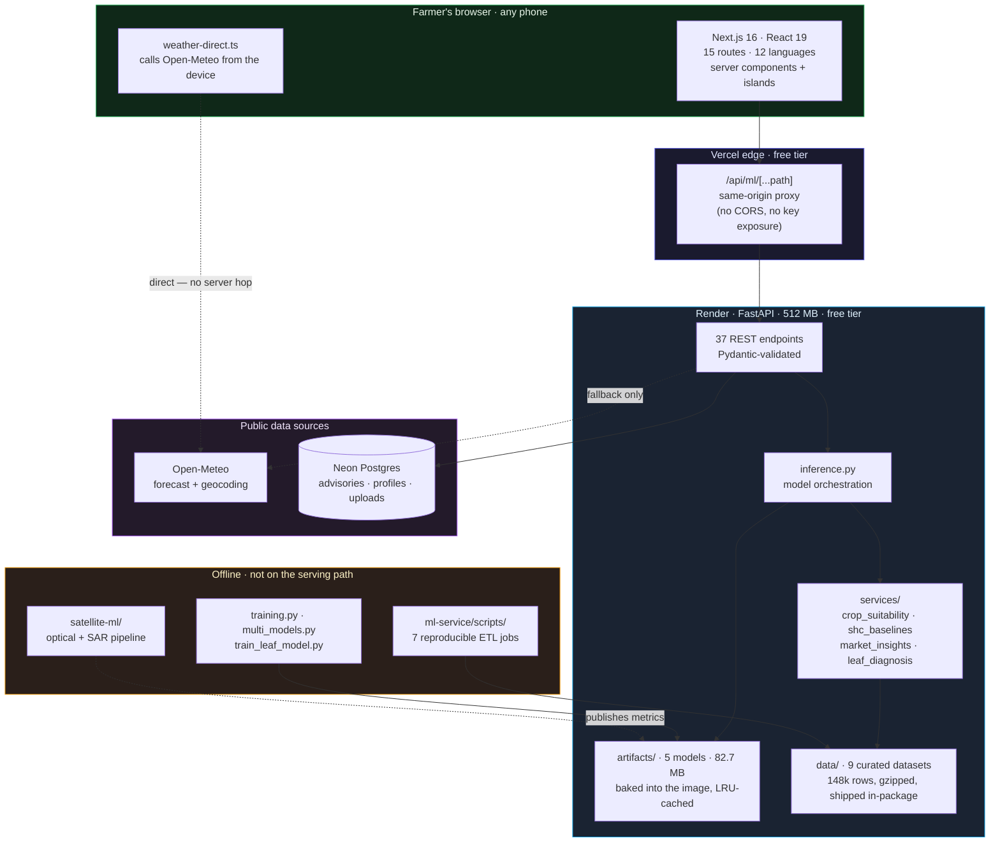
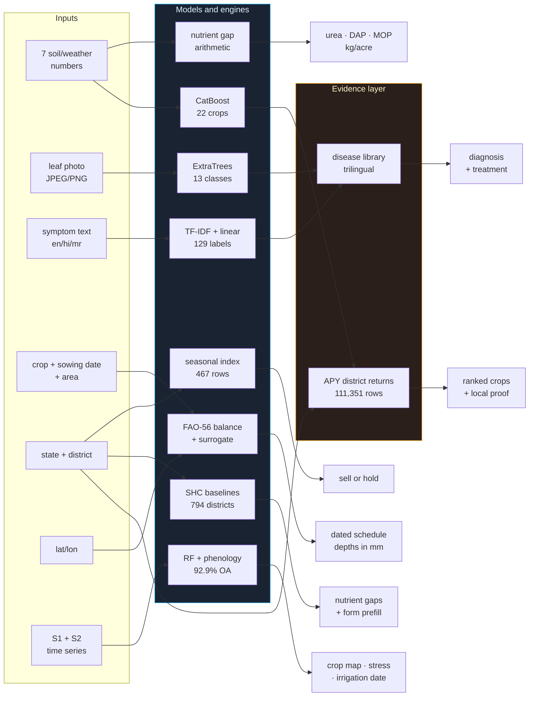
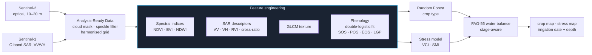
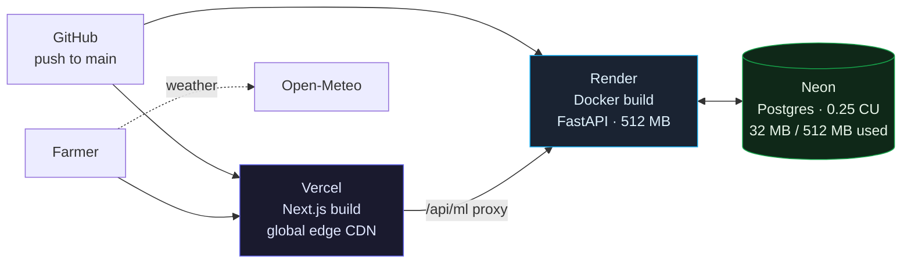

<div align="center">

# KrishiMitra

**Satellite-and-soil crop intelligence for Indian smallholders — trained on government data, served free.**

A farmer enters seven soil and weather numbers, or photographs a diseased leaf, and gets back a
ranked recommendation grounded in five years of district-level government crop returns, 13.35
million Soil Health Card tests, and a classifier trained on 10,162 labelled field images — in
twelve Indian languages, on a phone, at zero infrastructure cost.

[](https://krishimitra-blush.vercel.app)
[](https://krishimitra-api-t0wu.onrender.com/docs)
[](ml-service/pyproject.toml)
[](package.json)

**[Live app](https://krishimitra-blush.vercel.app)** · **[API docs](https://krishimitra-api-t0wu.onrender.com/docs)** · **[Satellite engine](satellite-ml/README.md)** · **[Design notes](docs/DESIGN.md)**

`agritech` · `machine-learning` · `remote-sensing` · `crop-recommendation` · `plant-disease-detection`
`precision-agriculture` · `irrigation-advisory` · `fastapi` · `nextjs` · `catboost` · `scikit-learn`
`open-government-data` · `sentinel-1` · `sentinel-2` · `india` · `multilingual` · `ndvi` · `sar`

</div>

---

## Table of Contents

- [The Problem](#the-problem)
- [What KrishiMitra Does](#what-krishimitra-does)
- [A Five-Minute Tour](#a-five-minute-tour)
- [System Architecture](#system-architecture)
- [Request Lifecycle](#request-lifecycle)
- [How Prediction Actually Works](#how-prediction-actually-works)
  - [1 · Crop recommendation](#1--crop-recommendation--catboost--district-evidence)
  - [2 · Leaf photograph diagnosis](#2--leaf-photograph-diagnosis--68-hand-crafted-features--extratrees)
  - [3 · Symptom text diagnosis](#3--symptom-text-diagnosis--tf-idf--linear-classifier)
  - [4 · Irrigation schedule](#4--irrigation-schedule--water-balance--learned-surrogate)
  - [5 · Fertilizer recommendation](#5--fertilizer-recommendation--nutrient-gap-arithmetic)
  - [6 · Soil health baselines](#6--soil-health-baselines--13-million-shc-tests)
  - [7 · Market price seasonality](#7--market-price-seasonality--seasonal-index)
  - [8 · Weather](#8--weather--browser-direct-with-server-fallback)
  - [9 · Satellite engine](#9--satellite-engine--optical--microwave-fusion)
- [Model Registry](#model-registry)
- [The Data Pipeline](#the-data-pipeline)
- [Training and Evaluation](#training-and-evaluation)
- [Deployment](#deployment)
- [Repository Layout](#repository-layout)
- [Getting Started](#getting-started)
- [API Reference](#api-reference)
- [Testing](#testing)
- [Known Limitations](#known-limitations)

---

## The Problem

An Indian smallholder farms about 1.08 hectares. The decisions that determine whether that year is
profitable — what to sow, when to irrigate, whether the spots on a leaf need a spray — are made with
information that is either unavailable, in the wrong language, or aggregated at a scale too coarse to
act on.

The public data to answer these questions **already exists**. The Directorate of Economics and
Statistics publishes district-level area, production and yield for every crop and season. The Soil
Health Card scheme has run over 13 million nutrient tests. Agmarknet publishes daily mandi arrivals.
ISRO and Copernicus give away moderate-resolution optical and SAR imagery.

It is scattered across portals, served as malformed HTML masquerading as `.xls`, documented in PHP
debug dumps, and published only in English. **KrishiMitra is the plumbing between that data and the
farmer's phone.**

The satellite subsystem additionally addresses a specific problem statement:

> *AI-Driven Automated Crop Type, Moisture Stress Detection and Irrigation Advisory Across Growth
> Stages Using Moderate Resolution Spectral Signatures (Optical and Microwave Satellite Data).*

---

## What KrishiMitra Does

Fifteen modules, each answering a question a farmer actually asks. Every one is wired to a live
endpoint — none are mockups.

| Module | Farmer's question | What answers it |
|---|---|---|
| **Crop Intelligence** | "What should I sow?" | CatBoost over 7 soil/weather features, cross-checked against 5 years of district returns |
| **Pest & Disease** | "What is wrong with this leaf?" | Photo → 68 colour/texture/lesion features → ExtraTrees; or symptoms in Hindi/Marathi → TF-IDF |
| **Irrigation Planner** | "When do I water, and how much?" | FAO-56 water balance, stage-aware, adjusted by live forecast |
| **Soil Health** | "Is my soil short of anything?" | District SHC baselines from 13.35M government tests, prefilled into the form |
| **Fertilizer** | "How much urea, DAP, MOP?" | Nutrient-gap arithmetic against crop uptake targets |
| **Weather** | "Will it rain this week?" | Open-Meteo, fetched browser-direct, with derived sowing/spray advisories |
| **Market Prices** | "Should I sell now or hold?" | Monthly typical bands and a seasonal index from 737k Agmarknet records |
| **Crop Suitability** | "What actually grows here?" | 23,047 scored district × crop × season combinations |
| **Schemes** | "What subsidy can I claim?" | Curated catalogue of 12 central and state schemes |
| **Knowledge Library** | "How do I do this?" | 16 long-form agronomy articles |
| **News** | "What changed?" | Agriculture news feed |
| **Tool Rental** | "Where do I hire a tiller?" | Equipment rental listings by district |
| **Farmer History** | "What did I do last season?" | Every advisory persisted and replayable per mobile number |
| **Model Insights** | "Why should I trust this?" | Live feature importances, class distributions, model scores |
| **Satellite Engine** | "How is my field doing from space?" | Optical + SAR fusion: crop type, moisture stress, irrigation timing |

All fifteen render in **twelve languages** — English, Hindi, Marathi, Punjabi, Bengali, Telugu,
Tamil, Kannada, Gujarati, Malayalam, Odia and Assamese.

---

## A Five-Minute Tour

1. Open **[krishimitra-blush.vercel.app](https://krishimitra-blush.vercel.app)**. The first request
   after idle wakes the free-tier API — allow 60–90 seconds; the dashboard fires a warm-up ping on
   mount and backs off progressively rather than failing.
2. Switch language in the header. Twelve options; anything not yet translated falls back to English
   honestly rather than showing a blank.
3. **Soil Health** → pick your state and district. The nutrient fields prefill from the Soil Health
   Card baseline for that district — a real government measurement, not a guess.
4. **Crop Intelligence** → submit. You get three ranked crops with calibrated probabilities, and
   where the district is known, each is annotated with what five years of government returns say
   about that crop's local yield and reliability.
5. **Pest & Disease** → upload a leaf photo. Cotton, rice and sugarcane are covered across 13
   classes. Below 35 % confidence the system says *"photo unreadable"* instead of guessing.
6. **Irrigation Planner** → enter crop, sowing date, area. You get a dated schedule with depths in
   millimetres, adjusted for forecast rainfall.
7. **Model Insights** → see the actual numbers behind everything above.

---

## System Architecture

The shape of this system was decided by one constraint: **it must cost nothing to run and must not
require the farmer to have a good connection or a modern phone.** Every architectural decision below
follows from that.



### Three decisions worth explaining

**Models are baked into the image, never downloaded at boot.** A free Render instance has 512 MB of
RAM and no persistent disk. Downloading 82 MB of joblib artifacts on every cold start would add
latency to an already slow wake and would fail whenever the artifact host was down. They ship in the
container; `warm_models()` loads them once behind an `lru_cache` keyed on file mtime, so a retrain
busts the cache without a restart.

**The browser fetches weather itself.** Render's free tier shares an egress IP across many tenants,
and Open-Meteo rate-limits by IP — the API was getting `429` in production while working perfectly in
development. Caching alone could not fix it, because a cold cache still makes the first call from the
poisoned IP. Moving the call into the browser means every farmer spends their *own* allowance. The
server path survives as a fallback with 1 h forecast / 24 h geocode / 6 h stale-serve caching.

**The frontend talks to `/api/ml/*`, never to Render directly.** A same-origin proxy means no CORS
preflight on every request, no backend URL in the client bundle, and the ability to repoint the API
without rebuilding the frontend.

---

## Request Lifecycle

What actually happens between a farmer tapping *Recommend* and seeing three crops:

```mermaid
sequenceDiagram
    autonumber
    participant F as Farmer
    participant W as Next.js (Vercel)
    participant P as /api/ml proxy
    participant A as FastAPI (Render)
    participant M as Model cache
    participant D as Datasets
    participant DB as Neon Postgres

    F->>W: opens /dashboard
    W->>P: GET /warmup (fire-and-forget)
    P->>A: wake instance
    Note over A: cold start 60–110 s;<br/>client backs off 6/12/20/30/40 s

    F->>W: submits N·P·K·temp·humidity·pH·rainfall
    W->>P: POST /predict/crop
    P->>A: forward (same origin, no CORS)
    A->>A: Pydantic validates ranges
    A->>M: load crop_model.joblib (LRU, mtime-keyed)
    M-->>A: CatBoostClassifier
    A->>A: predict_proba → 22 class probabilities
    A->>A: argsort → top 3 + confidence bands

    alt district known
        A->>D: crop_suitability.local_evidence(state, district, crop, season)
        D-->>A: 5-yr yield · rank · reliability
        A->>D: crop_suitability.recommend(...) → top 6 locally proven
    end

    A->>A: generate field actions (agronomy rules)
    A->>DB: persist advisory (mobile-keyed, replayable)
    A-->>W: ranked crops + local evidence + actions
    W-->>F: rendered in chosen language
```

The `local_evidence` lookup is wrapped in a `try/except` that logs and continues. **A prediction must
never fail because the enrichment layer failed** — the farmer gets the model's answer even if the
government-data join is unavailable.

---

## How Prediction Actually Works

This is the heart of the project. Nine prediction paths, each documented from raw input to rendered
output. Where a path is *not* machine learning, that is stated plainly.



### 1 · Crop recommendation — CatBoost + district evidence

**Endpoint** `POST /predict/crop` · **Code** [`services/inference.py:472`](ml-service/src/agrotech_ml/services/inference.py) · **Artifact** `crop_model.joblib` (22.5 MB)

**Input** — seven numbers, Pydantic-validated for physically plausible ranges:

| Feature | Unit | Learned importance |
|---|---|---|
| `humidity` | % | **0.226** |
| `rainfall` | mm | **0.185** |
| `K` (potassium) | kg/ha | **0.165** |
| `N` (nitrogen) | kg/ha | **0.157** |
| `P` (phosphorus) | kg/ha | **0.145** |
| `temperature` | °C | 0.094 |
| `ph` | — | 0.028 |

That ordering is worth reading: **the model leans on climate before chemistry**. Humidity and
rainfall together carry 41 % of the decision, all three macronutrients 47 %, and pH almost nothing.
This is agronomically sensible — pH constrains which crops are *possible*, but within the feasible
set it barely discriminates.

**Inference, step by step:**

1. `ensure_model_artifacts()` — fails fast with an actionable message if artifacts are missing,
   rather than 500-ing deep inside a predict call.
2. `_load_crop_artifact()` — `lru_cache` keyed on `(path, mtime)`. Load cost is paid once per
   process, and a retrain invalidates it automatically.
3. Build a single-row `DataFrame` **with the column order stored in the artifact**, not a hardcoded
   list. Column order is part of the trained contract; reconstructing it from a constant is how
   silent feature-shuffling bugs happen.
4. `predict_proba` → a 22-length probability vector.
5. `argsort()[::-1][:3]` → top three, each with a calibrated probability and a confidence band.
6. `_generate_field_actions()` → agronomy rules keyed to the winning crop (sowing window, seed rate,
   first irrigation, basal dose).

**Then the part that makes it more than a toy.** If the farmer's state and district are known:

```python
evidence = crop_suitability.local_evidence(state, district, crop, season)
local_crops = crop_suitability.recommend(state, district, season, limit=6)
```

This joins the model's answer against `apy_long.csv.gz` — **111,351 rows of actual Directorate of
Economics and Statistics returns**, five years of area, production and yield per district × crop ×
season. Each recommendation is annotated with what that crop really yields there and how reliably.

The reasoning: *a crop that suits the soil **and** is proven locally is a far stronger
recommendation than either signal alone. A crop that suits the soil but nobody in the district grows
is a flag, not an endorsement.* The model proposes; the government record disposes.

**Honest note on the accuracy figure.** The soil model reports **99.55 %** — see
[Training and Evaluation](#training-and-evaluation) for why that number is a property of the dataset,
not evidence of a hard problem solved.

---

### 2 · Leaf photograph diagnosis — 68 hand-crafted features + ExtraTrees

**Endpoint** `POST /disease/diagnose/photo` · **Code** [`services/leaf_features.py`](ml-service/src/agrotech_ml/services/leaf_features.py), [`leaf_diagnosis.py`](ml-service/src/agrotech_ml/services/leaf_diagnosis.py) · **Artifact** `leaf_model.joblib` (27.4 MB)

**This is deliberately not a CNN.** PyTorch alone is roughly 800 MB installed; the serving instance
has 512 MB of RAM. Rather than abandon photo diagnosis or pay for a bigger box, the pipeline uses
**classical computer vision with an explicit feature contract** — which fits in memory, runs in
milliseconds on CPU, and is fully inspectable.

The image is resized to **128 × 128** and reduced to **68 features** in four families:

```
 ├─ Channel statistics ....... mean, std, skew over R, G, B, H, S, V     (18)
 ├─ Quantised histograms ..... 3×3×3 RGB cube (27) + 8-bin hue ring       (35)
 ├─ Difference-GLCM texture .. contrast/homogeneity at 4 offsets          (11)
 └─ Lesion coverage .......... frac_brown, frac_yellow, frac_dark,
                               frac_green + excess-green index             (4)
```

Each family maps to something a plant pathologist looks for: **colour statistics** catch chlorosis,
**hue histograms** separate rust-orange from blight-brown, **GLCM texture** captures whether lesions
are speckled or confluent, and **lesion fractions** measure how much of the leaf is actually
affected — the difference between an early spot and a lost plant.

The critical design property: **`extract_features()` is the same function at training time and at
inference time.** There is no separate preprocessing script that can drift out of sync with the
serving path — the most common and most silent failure mode in deployed vision systems.

**Classifier** — `ExtraTreesClassifier`, chosen over RandomForest after comparison: the extra
randomisation in split selection regularises better on 68 correlated hand-crafted features.

- **10,162 labelled images**, 13 classes across cotton, rice and sugarcane
- **93.75 % accuracy**, field-disjoint validation

**Two safety behaviours that matter more than the accuracy number:**

```python
MIN_CONFIDENCE = 0.35   # below this the photo is "unreadable", not guessed at
```

A wrong confident diagnosis costs a farmer a spray they did not need — money, chemical load, and
trust. Below threshold the API says the photo could not be read and asks for a clearer one.

Second, treatment text is **looked up directly in the disease library** by the predicted label. An
earlier version fed the predicted label back through the TF-IDF text classifier, which returned
*"Cotton leaf curl virus" at 0.94 confidence for a demonstrably healthy leaf.* Composing two
classifiers in series compounds their errors; the fix was to stop composing them. Both the photo path
and the text path now resolve into the same trilingual library, so a farmer gets identical advice
regardless of how they described the problem.

---

### 3 · Symptom text diagnosis — TF-IDF + linear classifier

**Endpoint** `POST /disease/diagnose` · **Artifact** `disease_model.joblib` (11.5 MB)

For farmers who cannot photograph the leaf but can describe it. Free text in English, Hindi or
Marathi → character and word n-gram TF-IDF → linear classifier over **129 crop-disease labels**
spanning **14 crops**.

The training corpus `disease_symptoms.csv` (**2,239 rows**) is genuinely trilingual — it carries
`symptoms_hi`, `treatment_hi`, `disease_mr`, `symptoms_mr` and `treatment_mr` columns, so a farmer
typing *"पत्तों पर भूरे धब्बे"* is matched against Hindi training text rather than against a machine
translation of English.

Every row carries a `source` column. Advice a farmer might act on should be traceable to where it
came from.

---

### 4 · Irrigation schedule — water balance + learned surrogate

**Endpoint** `POST /irrigation/schedule` · **Artifact** `irrigation_model.joblib` (15.8 MB)

**Be clear about what this is.** The shipped `irrigation_model.joblib` is a RandomForest fitted on
labels generated by rules in [`multi_models.py:46`](ml-service/src/agrotech_ml/services/multi_models.py).
It is a **fast surrogate for a rule system**, not a model that learned irrigation from observed field
outcomes. It cannot be more correct than the rules it was fitted to. It is included because it gives
smooth, consistent behaviour across the input space and serves in a single vectorised call.

The **real** water-balance physics lives in
[`satellite-ml/advisory/water_balance.py`](satellite-ml/src/krishimitra_rs/advisory/water_balance.py)
and implements FAO-56 properly:

- **TAW** — total available water from soil texture and rooting depth
- **RAW** — readily available water, `TAW × p` with a stage-dependent depletion fraction
- **Kc** — crop coefficient stepped across initial → development → mid → late stages
- **Prognostic depletion** — each day's soil-water deficit carried forward and updated by
  evapotranspiration minus effective rainfall, so the schedule has memory

Irrigation is triggered when depletion crosses RAW, and the recommended depth is the amount needed to
refill to field capacity. Forecast rainfall from the weather module suppresses an irrigation that
rain is about to make unnecessary.

Land area is normalised through `_unit_to_acres()`, which accepts Acres, Hectares, **Bigha and
Katha** — because a farmer in Bihar thinks in bigha, not hectares.

---

### 5 · Fertilizer recommendation — nutrient-gap arithmetic

**Endpoint** `POST /fertilizer/recommend` · **Artifact** `fertilizer_model.joblib` (5.5 MB)

Same honesty applies: labels are generated by `_fertilizer_label(n, p, k, ph)`, so the model is a
surrogate for arithmetic. Current N-P-K is compared against the target uptake for the chosen crop and
the gap converted into urea, DAP and MOP at kg/acre, then scaled to the farmer's land unit.

Where a Soil Health Card baseline exists for the district, current values prefill from that
government measurement instead of being guessed.

---

### 6 · Soil health baselines — 13 million SHC tests

**Endpoints** `GET /soil/baseline`, `POST /soil/analyze` · **Data** `shc_district_baselines.csv.gz` (**794 districts**)

Built by [`scripts/fetch_shc_baselines.py`](ml-service/scripts/fetch_shc_baselines.py) against the
Soil Health Card GraphQL API, aggregating **13.35 million individual nutrient tests** into
district-level dominant classes.

The gating rule is the interesting part:

```python
MIN_NUTRIENT_SAMPLES = 100   # applied PER NUTRIENT, not per district
```

Ludhiana has **5,942 phosphorus samples and exactly one nitrogen sample**. A district-level threshold
would have accepted both or rejected both; either is wrong. Gating each nutrient on its own sample
count means Ludhiana's phosphorus baseline is published and its nitrogen baseline is not — the
strongest possible statement the data supports, and no stronger.

Baselines feed the Soil Health form as prefilled values, so a farmer who does not know their nitrogen
level starts from their district's measured reality rather than from zero.

---

### 7 · Market price seasonality — seasonal index

**Endpoint** `GET /market/prices` · **Data** `mandi_seasonality.csv.gz` (467 rows)

**737,000 Agmarknet records** reduced to monthly typical price bands and a seasonal index per
commodity. The index is computed **within commodity** and is level-shift proof, so a year of general
inflation does not read as seasonality.

Worked example: onion sits at index **0.61** during the rabi glut and **1.67** in November — a farmer
holding stock through that window is looking at a materially different price.

Coverage is deliberately narrow: **five staples only.** A commodity without enough history gets no
claim at all rather than a noisy one. Under-promising here is the correct behaviour when the output
is a sell-or-hold decision on someone's income.

---

### 8 · Weather — browser-direct with server fallback

**Primary** [`lib/weather-direct.ts`](lib/weather-direct.ts) · **Fallback** `GET /weather/forecast`

The browser calls **Open-Meteo** directly — `api.open-meteo.com/v1/forecast` for conditions,
`geocoding-api.open-meteo.com/v1/search` for place lookup. No API key, and Open-Meteo sends
`access-control-allow-origin: *`, so the call works from the page.

The server path remains as a fallback with explicit cache policy:

```python
WEATHER_CACHE_TTL_SECONDS   = 3_600     # forecasts change hourly at best
GEOCODE_CACHE_TTL_SECONDS   = 86_400    # town coordinates do not move
STALE_WEATHER_MAX_AGE_SECONDS = 21_600  # 6 h stale beats no answer at all
```

Advisories are derived from the forecast against stated thresholds — ≥ 50 mm (heavy rain, delay
sowing), ≥ 10 mm (skip irrigation), ≥ 38 °C (heat stress), ≤ 5 °C (cold stress) — implemented
identically in `_forecast_advisory()` (Python) and `forecastAdvisory()` (TypeScript) so both paths
agree.

> **Removed, and worth recording.** An earlier build derived a "soil hint" from
> `(abs(lat) + abs(lon)) % 2 > 1`, printing *"Loamy balance likely"* or *"Clay loam tendency"* by
> coordinate parity. It was fabrication dressed as inference and has been deleted. The Soil Health
> module now answers that question from real SHC measurements.

---

### 9 · Satellite engine — optical + microwave fusion

**Package** [`satellite-ml/`](satellite-ml/README.md) · 2,941 lines · 13 tests

This is the subsystem addressing the remote-sensing problem statement, and it is the most
methodologically serious ML in the repository.



**Why fuse optical and microwave.** Optical indices are the better vegetation signal but are blinded
by cloud — precisely during the monsoon, when Indian irrigation decisions matter most. C-band SAR
penetrates cloud and responds to canopy structure and surface moisture. Fusing them gives a series
with no monsoon gap.

**Phenology as a feature, not an afterthought.** A double-logistic curve is fitted to each field's
NDVI series to extract start-of-season, peak, end-of-season and length-of-growing-period. This is
what lets the classifier separate crops with similar spectra but different calendars, and what lets
the advisory know which growth stage a field is in — the problem statement asks for advice *across
growth stages*, which requires knowing the stage.

**Validated results** (Random Forest, deployed configuration):

| Metric | Value |
|---|---|
| Overall Accuracy | **92.92 %** (target > 85 %) |
| Cohen's κ | **0.9151** |
| Wheat F1 | 0.931 (P 0.918 · R 0.944) |
| Advisory vs. true Ks correlation | **−0.371** |

That last row is the one that matters, and it is negative **by design**: as the true water-stress
coefficient falls, recommended irrigation rises. A positive correlation would mean the advisory was
telling farmers to water fields that were already wet.

> **Two failures on this metric are worth documenting.** It first read **+0.095** — the right
> magnitude, the wrong sign — because a diagnostic water balance had replaced the prognostic one
> without the metric being re-derived. Earlier still, the README carried **−0.44** from a prior run,
> which had quietly become wrong. The fix in both cases was to correct the physics and recompute, not
> to adjust the published number.

**Simulated by default, real-data ready.** The pipeline ships with a physically-grounded simulator
([`data/simulate.py`](satellite-ml/src/krishimitra_rs/data/simulate.py)) so anyone can clone and run
the full pipeline with no Earth Engine credentials. `data/gee_ingest.py` is the swap-in for real
Sentinel scenes. **The headline metrics above are measured on simulated data and are therefore an
upper bound** — real imagery brings mixed pixels, registration error and label noise that the
simulator does not.

Getting the simulator honest took work. An early version reported **100 % accuracy**, which is a
smell, not a success: every field of a given crop had an identical signature. Per-field jitter —
sowing date ± 5 days, vigour ± 7 %, SAR structure ± 1.2 dB — brought it to a believable 92.9 %.
Separately, sugarcane produced a flat NDVI curve because `(doy - start) % 365` breaks for crops whose
season crosses a year boundary; `_event_sd()` now resolves phenology dates to the calendar year
nearest the season midpoint.

---

## Model Registry

Five artifacts ship in the serving image. Total **82.7 MB** on disk, **264 MB** resident once loaded.

| Artifact | Algorithm | Task | Training data | Held-out score | Size |
|---|---|---|---|---|---|
| `crop_model.joblib` | **CatBoost** | 22-class crop recommendation | 2,200 rows × 7 features | 99.55 % acc · 0.9955 macro-F1 · 100 % top-3 | 22.5 MB |
| `leaf_model.joblib` | **ExtraTrees** | 13-class leaf disease from photo | 10,162 images × 68 features | **93.75 % acc** | 27.4 MB |
| `disease_model.joblib` | TF-IDF + linear | 129-label symptom text | 2,239 trilingual rows | — | 11.5 MB |
| `irrigation_model.joblib` | RandomForest | irrigation timing surrogate | rule-generated | *fits rules, not outcomes* | 15.8 MB |
| `fertilizer_model.joblib` | RandomForest | fertilizer class surrogate | rule-generated | *fits rules, not outcomes* | 5.5 MB |
| *(separate package)* | RandomForest | crop type from S1+S2 | simulated fields | **92.92 % OA · κ 0.9151** | — |

Model selection for the crop task was a real bake-off, not a single fit — seven algorithms trained
and compared, recorded in [`artifacts/model_metadata.json`](ml-service/artifacts/model_metadata.json):

| Rank | Model | Accuracy | Macro-F1 | Top-3 | Train time |
|---|---|---|---|---|---|
| **1** | **CatBoost** | **0.9955** | **0.9955** | 1.000 | 7.05 s |
| 2 | Random Forest | 0.9932 | 0.9932 | 1.000 | 0.09 s |
| 3 | Extra Trees | 0.9932 | 0.9932 | 1.000 | 0.06 s |
| 4 | SVC-RBF | 0.9886 | 0.9887 | 1.000 | 0.08 s |
| 5 | HistGradientBoosting | 0.9886 | 0.9886 | 0.9977 | 6.12 s |
| 6 | LightGBM | 0.9886 | 0.9886 | 1.000 | 13.85 s |
| 7 | Logistic Regression | 0.9727 | 0.9725 | 1.000 | 0.02 s |

CatBoost wins by **0.23 percentage points over a RandomForest that trains 75× faster.** On a
different project that trade would not be worth taking; here training is offline and one-off while
inference is what farmers wait on, so the marginal accuracy is free at serving time.

---

## The Data Pipeline

Nine datasets, ~148,000 rows, all shipped in-package and gzipped. **Five come from government or
open sources; four are authored.** Every derived dataset has a reproducible build script in
[`ml-service/scripts/`](ml-service/scripts/) — no dataset in this repo is a mystery blob.

| Dataset | Rows | Origin | Built by |
|---|---|---|---|
| `apy_long.csv.gz` | **111,351** | DES district crop returns, 5 years | `build_apy_dataset.py` |
| `crop_suitability.csv.gz` | **23,047** | derived from APY | `build_crop_suitability.py` |
| `leaf_features.csv` | **10,162** | public leaf-image corpora | `train_leaf_model.py` |
| `disease_symptoms.csv` | **2,239** | trilingual disease corpus, CC BY 4.0 | `build_disease_dataset.py` |
| `Crop_dataset.csv` | 2,200 | soil-nutrient crop recommendation set | — |
| `shc_district_baselines.csv.gz` | **794** | Soil Health Card GraphQL, 13.35M tests | `fetch_shc_baselines.py` |
| `mandi_seasonality.csv.gz` | 467 | Agmarknet, 737k records | `build_mandi_seasonality.py` |
| `disease_symptoms_curated.csv` | 100 | hand-curated | authored |
| `knowledge_library.json` · `schemes_catalog.json` | 16 · 12 | authored | authored |

### Cleaning and transformation: what the data actually required

**The APY export was not a spreadsheet.** The portal serves a file named `.xls` that is really an
HTML table, whose header `colspan` attributes disagree with its body. Parsing it as Excel yields
garbage; parsing the visible header yields misaligned columns. The authoritative column specification
turned out to be a **PHP array dump the portal leaked in a debug response** — that dump, not the
rendered header, defines the schema the loader uses. Rowspan cells carry forward for district names
that appear once above several crop rows.

Transformation: **573 wide columns → 111,351 long rows** of `(state, district, crop, season, year,
area, production, yield)`.

**Unit heterogeneity nearly produced nonsense.** Coconut yield has a median of **8,519** and wheat a
median of **3** — because coconut is reported in *nuts per hectare* and wheat in *tonnes per
hectare*. Any cross-crop ranking would have declared coconut the best crop in India. **All ranking is
therefore computed within `crop × season`**, using percentile rank inside the group. Crops are only
ever compared against themselves elsewhere in the country.

**Season labelling is not consistent across states.** Uttar Pradesh files sugarcane as *Kharif*;
Karnataka and Maharashtra file it as *Whole Year*. `crop_suitability.py` documents the fallback chain
explicitly rather than silently dropping rows that do not match the requested season.

### Feature engineering: the suitability score

`build_crop_suitability.py` collapses five years of returns per district × crop × season into one
comparable score:

```
score = 0.45 × suitability  +  0.35 × adoption  +  0.20 × reliability
        ─────────────────      ────────────────     ────────────────
        within-crop yield      share of district    inverse year-on-year
        percentile             area planted         yield variance
```

Each term answers a different question. **Suitability**: does this crop yield well here relative to
where else it is grown? **Adoption**: do farmers here actually plant it — a proxy for everything the
data does not capture, from market access to labour to local knowledge. **Reliability**: does it
yield consistently, or is it a gamble? A crop that yields spectacularly one year in three is not the
recommendation a smallholder with no buffer needs.

### Validation by agronomy, not just by metric

The strongest check on this pipeline is not a held-out score, it is whether the output matches known
ground truth:

- **Ludhiana → Wheat (Rabi) / Rice (Kharif)** — Punjab's actual, documented rotation.
- **Onion seasonal index 0.61 at the rabi glut, 1.67 in November** — matches the known price cycle.

A recommender that produces the right answer for Punjab is far more trustworthy than one with a good
cross-validation number and no agronomic sanity check.

---

## Training and Evaluation

```bash
# Rebuild every derived dataset from source (offline, reproducible)
python ml-service/scripts/build_apy_dataset.py
python ml-service/scripts/build_crop_suitability.py
python ml-service/scripts/fetch_shc_baselines.py
python ml-service/scripts/build_mandi_seasonality.py
python ml-service/scripts/build_disease_dataset.py
python ml-service/scripts/validate_catalogs.py     # gate: no dataset ships unvalidated
```

```bash
# Train the crop bake-off and auxiliary models
python -m agrotech_ml.services.training
```

```bash
# Retrain the leaf classifier without re-extracting features from 10k images
python ml-service/scripts/train_leaf_model.py --from-features
```

The `--from-features` path exists because feature extraction over 10,162 images dominates the
training cost. Caching `leaf_features.csv` turns a classifier retrain from tens of minutes into
seconds, and — more importantly — guarantees that a retrain uses *exactly* the features the previous
model saw.

### Reading the 99.55 % honestly

`Crop_dataset.csv` is a well-known, well-separated 2,200-row benchmark. Seven algorithms all land
between 97 % and 99.6 %, and even **logistic regression reaches 97.3 %** — when a linear model nearly
saturates a task, the task is close to linearly separable and the headline number reflects the
dataset's easiness, not the model's sophistication.

**This is stated here so nobody reads 99.55 % as a claim about crop recommendation being solved.**
The genuinely hard, genuinely validated results in this repository are the leaf classifier at
**93.75 % over 10,162 real images** and the satellite classifier at **92.92 % OA with κ = 0.9151**
under field-disjoint validation. Those are the numbers to judge the project on.

Where evaluation is deliberately strict:

- **Field-disjoint splits** in the satellite pipeline — images or pixels from one field never appear
  in both train and test, which is how remote-sensing accuracy gets silently inflated.
- **Cohen's κ alongside accuracy** — accuracy flatters an imbalanced class distribution; κ corrects
  for agreement by chance.
- **Physical plausibility as a metric.** `advisory_vs_trueKs = −0.371` checks that the advisory moves
  in the correct *direction* against ground truth. A model can be accurate and still give backwards
  advice.

---

## Deployment

Three providers, all on free tiers, all scaling to zero. **Running cost: ₹0 / month.**



| Layer | Provider | Plan | Notes |
|---|---|---|---|
| Frontend | **Vercel** | Hobby | Global CDN, auto-deploy on push to `main` |
| API | **Render** | Free (512 MB) | Docker; sleeps after 15 min idle |
| Database | **Neon** | Free (0.25 CU) | Postgres; scales to zero; 32 MB of 512 MB used |
| Weather | **Open-Meteo** | Free | No key; called browser-direct |

### This replaced a ₹3,100/month GCP design

The original architecture targeted Google Cloud at roughly **$37/month, of which about 85 % was Cloud
SQL** — a managed Postgres billed by the hour whether or not anyone queries it. For a project whose
traffic is bursty and whose database holds 32 MB, paying continuously for an always-on instance is
the wrong shape. All three replacements scale to zero, which is exactly the right billing model for
this workload.

### Cold starts, and what actually fixed them

A free Render instance sleeps after 15 minutes. Waking takes 60–110 seconds, and — critically — it
answers `502`/`503` **immediately** while spinning up rather than holding the connection. A naive
retry therefore exhausts itself in seconds and reports failure while the wake is still in progress.

Shipped mitigations:

```typescript
const COLD_START_BACKOFF_MS = [6_000, 12_000, 20_000, 30_000, 40_000];
```

plus `warmUpBackend()` fired from `DashboardShell` on mount, so the instance starts waking while the
farmer is still reading the page.

`/health` and `/warmup` both answer **GET and HEAD**, because uptime monitors probe with HEAD and a
`405` reads as an outage. An external pinger every 5 minutes removes cold starts entirely.

> **GitHub Actions cron is not a keepalive.** `.github/workflows/keepalive.yml` is active on a
> `*/10` schedule but the API showed **one run in 2.5 hours** — scheduled workflows are heavily
> throttled. Use an external pinger (UptimeRobot, cron-job.org) instead.

### Fair-use caveats

Vercel Hobby and Open-Meteo's free tier are both **non-commercial**. This stack is correct for a
demonstration, a pilot, or a public-good deployment. Commercial use requires Vercel Pro and an
Open-Meteo commercial plan.

---

## Repository Layout

```
KrishiMitra/
├── app/                              Next.js 16 App Router — 15 routes
│   ├── dashboard/
│   │   ├── crop-intelligence/        CatBoost recommendation + district evidence
│   │   ├── pest-detection/           photo and text disease diagnosis
│   │   ├── irrigation-planner/       FAO-56 stage-aware schedule
│   │   ├── soil-health/              SHC baselines, prefilled
│   │   ├── fertilizer/  weather/  market-prices/  schemes/
│   │   ├── knowledge/  news/  tool-rental/  farmer-history/
│   │   └── model-insights/           live metrics from the served artifacts
│   └── api/ml/[...path]/route.ts     same-origin proxy to FastAPI
│
├── components/                       React 19 UI
├── lib/
│   ├── api.ts                        typed client + cold-start backoff
│   ├── weather-direct.ts             browser-direct Open-Meteo
│   └── i18n.ts                       12 languages, honest English fallback
│
├── ml-service/                       FastAPI + the ML runtime
│   ├── src/agrotech_ml/
│   │   ├── api/                      37 REST endpoints
│   │   ├── services/
│   │   │   ├── inference.py          orchestrates every prediction path
│   │   │   ├── leaf_features.py      68 features — one contract, train and serve
│   │   │   ├── leaf_diagnosis.py     ExtraTrees + abstain threshold
│   │   │   ├── crop_suitability.py   APY district evidence join
│   │   │   ├── shc_baselines.py      per-nutrient sample gating
│   │   │   ├── market_insights.py    seasonal index
│   │   │   ├── training.py           7-model bake-off
│   │   │   ├── multi_models.py       auxiliary surrogates
│   │   │   └── datafiles.py          install-layout-proof data resolution
│   │   └── data/                     9 datasets, shipped in-package
│   ├── scripts/                      7 reproducible ETL + training jobs
│   └── artifacts/                    5 model files, baked into the image
│
├── satellite-ml/                     Optical + microwave RS pipeline
│   └── src/krishimitra_rs/
│       ├── data/       ard.py · simulate.py · gee_ingest.py
│       ├── features/   indices.py · texture.py · phenology.py · build.py
│       ├── models/     crop_classifier.py · stress.py · temporal_dl.py
│       ├── advisory/   phenology_stage.py · water_balance.py · irrigation.py
│       └── validation/ metrics.py
│
└── docs/               DESIGN.md · DEPLOY_FREE.md · DATASETS_WANTED.md
```

### One file worth calling out: `datafiles.py`

```python
def data_file(name: str) -> Path:
    for candidate in (_PACKAGE_DATA_DIR / name,
                      _REPO_DATA_DIR / name,
                      Path.cwd() / "data" / name):
        if candidate.is_file():
            return candidate
    return _PACKAGE_DATA_DIR / name
```

This exists because of a bug that shipped **twice**. The original code located datasets with
`Path(__file__).parents[3] / "data"`, which is correct under an editable install (a local `.venv`)
and resolves **into `site-packages`** under a normal install — which is how Render builds. The result
was catalogs silently returning empty lists in production while every local test passed.

The lesson is general: **any path computed relative to `__file__` by counting parent directories is a
latent production bug**, because the number of parents between your module and your data changes with
the install layout. Probing candidates in order fixes it for every layout.

---

## Getting Started

### Prerequisites

- **Python 3.13+** and **Node.js 20+**
- No API keys, no database, no cloud account — the default configuration runs entirely locally

### 1 · API

```bash
cd ml-service
python -m venv .venv && source .venv/bin/activate
pip install -e .
uvicorn agrotech_ml.api.main:app --reload --port 8000
```

API at `http://localhost:8000`, interactive docs at `/docs`. With no `.env` the service runs a
complete local stack: SQLite for persistence, local disk for uploads, artifacts read from
`ml-service/artifacts/`.

### 2 · Frontend

```bash
npm install
npm run dev
```

Dashboard at `http://localhost:3000`. Point it at your local API:

```bash
echo "ML_SERVICE_URL=http://localhost:8000" >> .env.local
```

### 3 · Satellite pipeline

```bash
cd satellite-ml
pip install -e .
python -m krishimitra_rs.pipeline        # runs end-to-end on the built-in simulator
```

No Earth Engine credentials required — the simulator produces physically-grounded optical and SAR
series so the full pipeline runs from a fresh clone.

> **Verify UI changes against a production build.** `next dev` can surface hydration errors that do
> not exist in `next build && next start`. Twice during development a dev-only artifact was mistaken
> for a real defect. Confirm with a production build before debugging.

---

## API Reference

**37 endpoints.** Full OpenAPI schema at
[`/docs`](https://krishimitra-api-t0wu.onrender.com/docs).

<details>
<summary><b>Prediction and advisory</b></summary>

| Method | Path | Purpose |
|---|---|---|
| `POST` | `/predict/crop` | CatBoost crop recommendation + district evidence |
| `POST` | `/predict` | legacy prediction alias |
| `POST` | `/disease/diagnose` | symptom text → diagnosis (en/hi/mr) |
| `POST` | `/disease/diagnose/photo` | leaf photo → diagnosis |
| `POST` | `/irrigation/schedule` | stage-aware irrigation schedule |
| `POST` | `/fertilizer/recommend` | urea / DAP / MOP by nutrient gap |
| `POST` | `/soil/analyze` | soil interpretation |
| `GET` | `/soil/baseline` | district SHC baseline |
| `GET` | `/crops/local` | locally proven crops for a district |

</details>

<details>
<summary><b>Data and content</b></summary>

| Method | Path | Purpose |
|---|---|---|
| `GET` | `/weather/forecast` | forecast (fallback; browser calls Open-Meteo directly) |
| `GET` | `/market/prices` | mandi bands + seasonal index |
| `GET` | `/knowledge/library` · `/search/knowledge` | agronomy articles |
| `POST` | `/schemes/recommend` | matching government schemes |
| `GET` | `/news/feed` | agriculture news |
| `GET` | `/rentals/tools` | equipment rental listings |
| `GET` | `/locations/search` | state / district lookup |
| `GET` | `/languages` · `/metadata` | supported languages, model metadata |

</details>

<details>
<summary><b>Profiles, operations and auth</b></summary>

| Method | Path | Purpose |
|---|---|---|
| `POST` `GET` | `/profiles/user` · `/profiles/farms` | farmer and farm records |
| `GET` | `/advisories/history/{mobile}` | replay past advisories |
| `POST` `GET` | `/uploads/assets` | image uploads |
| `GET` | `/dashboard/summary` | dashboard aggregate |
| `POST` `GET` | `/retrain` · `/retrain/status` | trigger and poll retraining |
| `POST` `GET` | `/auth/login` · `/auth/me` | JWT auth |
| `GET`/`HEAD` | `/health` · `/warmup` | liveness and wake (HEAD-safe) |

</details>

**Security posture.** In production (`AGROTECH_REQUIRE_WRITE_AUTH=true`) mutating and PII routes
require a bearer token, and the service **refuses to start without a JWT secret** rather than
defaulting to an insecure one. An earlier audit found 25+ unauthenticated routes, a stored XSS vector
and PII exfiltration through an unanchored `LIKE '%q%'` search — all closed. The SQLite database and
user uploads are gitignored, because they hold farmer PII.

---

## Testing

```bash
cd satellite-ml && pytest          # 13 tests over the full RS pipeline
python ml-service/scripts/validate_catalogs.py   # dataset integrity gate
npm run build                      # type-check + production build
```

The satellite suite covers index computation, phenology fitting, the water balance, the classifier
and the end-to-end pipeline — the components where a silent numerical error would be invisible in the
output but wrong in the advice.

---

## Known Limitations

Stated plainly, because a README that only lists strengths is not documentation.

**Model and data**

- **The 99.55 % crop accuracy reflects an easy dataset**, not a hard problem solved. Logistic
  regression gets 97.3 % on the same data. Judge the project on the leaf classifier (93.75 % over
  10,162 real images) and the satellite classifier (92.92 % OA, κ 0.9151).
- **Irrigation and fertilizer models are surrogates for rules I wrote**, not models fitted to
  observed field outcomes. They cannot be more correct than those rules.
- **Satellite metrics are measured on simulated data** and are an upper bound. Real Sentinel scenes
  bring mixed pixels, registration error and label noise.
- **Sugarcane leaf classes sit at F1 0.71–0.84**, the weakest in the model. Two larger public
  sugarcane corpora were evaluated and **rejected**: one (746 MB) has an unknown licence and zero Red
  Rot images — Red Rot being the weakest class — and the other has about twenty. Adding
  unknown-licence data that does not fix the weak class would have been the wrong trade.
- **Two image corpora have unlicensed or unclear provenance.** Documented rather than ignored.
- **Market seasonality covers five staples.** Everything else gets no claim rather than a noisy one.
- **XGBoost never enters the bake-off** — it raises `Invalid classes inferred from y` on this label
  encoding. The remaining six algorithms are compared.

**Product**

- **165 i18n keys remain untranslated** in the nine non-English/Hindi languages (the longer prose).
  Non-English blocks are typed `Partial<Record<...>>` so `t()` falls back to English visibly and the
  audit shows exactly what is missing. **These must not be padded with English strings** — that would
  hide the gap rather than close it.
- **Cold starts of 60–110 seconds** on the free tier until an external pinger is attached.
- **`/investor/opportunities` returns `[]`** and is called by `lib/api.ts` but rendered by no page.
  Harmless orphan.

---

## Acknowledgements

Built on public data. Directorate of Economics and Statistics (district crop returns), the Soil
Health Card scheme (13.35M nutrient tests), Agmarknet (mandi arrivals), Open-Meteo (forecasts), and
the Copernicus Sentinel-1 and Sentinel-2 missions.

---

<div align="center">

**[Open the app](https://krishimitra-blush.vercel.app)** · **[Read the API docs](https://krishimitra-api-t0wu.onrender.com/docs)** · **[Satellite engine](satellite-ml/README.md)**

</div>
