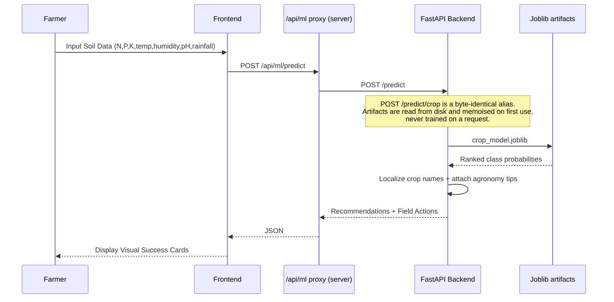

# KrishiMitra 🌾🛰️

**Empowering Indian Farmers with AI-Driven Agricultural Intelligence**

KrishiMitra is an agricultural decision support system designed to assist farmers in maximizing yield, optimizing resource usage, and navigating the complexities of modern farming. By combining machine learning, real-time data, and localized insights, it provides a "digital companion" for every step of the farming journey.

The platform has two engines:

- **Farmer advisory app** — a Next.js dashboard + FastAPI ML service (`ml-service/`) covering 13 farmer-facing modules (crop recommendation, soil health, pest detection, market prices, schemes, and more).
- **Satellite intelligence engine** — a remote-sensing ML pipeline (`satellite-ml/`) that turns optical + microwave (SAR) satellite data into **crop-type maps, phenology-aware moisture-stress maps and FAO-56 irrigation advisories** for canal command areas. See [`satellite-ml/README.md`](satellite-ml/README.md).

Both engines run **entirely offline on a laptop** (SQLite + local directories + a physically-grounded satellite simulator), and the farmer app swaps to managed services — Postgres, S3-compatible object storage — by setting environment variables, with no code change. Hosting the whole thing costs **$0/month**, with one honest asterisk documented below. See [Running it](#-running-it-local-first-then-free-hosting).

---

## 🚀 Key Modules

The platform ships **13 farmer-facing modules**, one page each, in the order they appear in the dashboard sidebar:

| # | Module | Route | What it actually does |
|---|--------|-------|------------------------|
| 1 | **Crop Intelligence** | `/dashboard/crop-intelligence` | Recommends crops from soil nutrients (N, P, K), pH, temperature, humidity and rainfall. Ensemble classifier, top-3 ranked with probabilities. |
| 2 | **Soil Health Analyzer** | `/dashboard/soil-health` | Rule-based soil scoring with nutrient alerts and corrective actions. Needs no trained model. |
| 3 | **Irrigation Planner** | `/dashboard/irrigation-planner` | Regression model that turns crop, soil moisture and weather into a dated irrigation event schedule. |
| 4 | **Fertilizer Guide** | `/dashboard/fertilizer` | Predicts an N-P-K blend plus a split-application schedule to avoid over-fertilization. |
| 5 | **Pest Detection** | `/dashboard/pest-detection` | **Text-based** symptom triage. A TF-IDF + logistic-regression classifier reads the farmer's typed symptom description and returns a likely disease, severity and preventive actions. See the note below. |
| 6 | **Weather Forecast** | `/dashboard/weather` | 1-10 day localized forecast via Open-Meteo, with agricultural advisory text. |
| 7 | **Market Prices** | `/dashboard/market-prices` | Mandi prices from the data.gov.in feed, cached, with automatic fallback to a committed sample CSV so the page is never empty. |
| 8 | **Govt Schemes** | `/dashboard/schemes` | Matches state and central schemes against the farmer's profile using the MyScheme catalogue. |
| 9 | **Tool Rental** | `/dashboard/tool-rental` | Machinery rental catalogue (tractors, tillers, harvesters) with a committed 10-entry fallback catalogue. |
| 10 | **Knowledge Base** | `/dashboard/knowledge` | Farming techniques and best practices, backed by Brave Search and Wikipedia lookups. |
| 11 | **Agri News** | `/dashboard/news` | Curated agricultural news feed from Google News RSS. May legitimately return an empty list when the upstream feed throttles. |
| 12 | **ML Models** | `/dashboard/model-insights` | Model transparency page: which algorithm won, per-model accuracy/macro-F1, feature importances, and any models that were skipped during training. |
| 13 | **Farmer History** | `/dashboard/farmer-history` | Profile management, farm records, uploads, and the full advisory history for the selected farmer. |

> **About Pest Detection.** It is a **text classifier over symptom descriptions**, not image analysis. The page lets you attach a photo and the file *is* stored against the farmer's record, but no vision model reads it — the diagnosis is produced entirely from the typed symptoms. Sending the same symptoms with and without an attached image returns a byte-identical response. Treat the upload as documentation for a human agronomist, not as model input.

---

## 🛰️ Satellite Intelligence Engine (`satellite-ml/`)

A separate, self-contained remote-sensing ML pipeline that addresses:
**AI-Driven Automated Crop Type, Moisture Stress Detection and Irrigation Advisory Across Growth Stages Using Moderate-Resolution Spectral Signatures (Optical & Microwave Satellite Data).**

It ingests multi-temporal **optical (Sentinel-2 / LISS / MODIS)** and **microwave SAR (Sentinel-1 / EOS-04)** data and produces three decision-ready map products:

1. **Crop-type map** — Random Forest / XGBoost on multi-temporal NDVI/EVI/NDWI + SAR VV/VH/RVI + GLCM texture + phenology metrics, validated with Overall Accuracy & Cohen's Kappa on a field-disjoint split.
2. **Stage-wise moisture-stress maps** — VCI (optical) + SMI (SAR soil moisture), fused and weighted by growth stage (flowering treated as most drought-sensitive).
3. **8-day irrigation advisory** — FAO-56 crop-water-deficit (ETc, root-zone water balance) translated into per-pixel irrigation-status maps for canal command-area planning.

It **runs end-to-end with zero downloads** via a physically-grounded optical+SAR simulator, and swaps to **real Sentinel-1/2 via Google Earth Engine** by changing one config line — `data.source: gee` in `config/pilot_area.yaml`, or `--source gee` on the command line.

> **Earth Engine is an optional satellite _data_ source, not an infrastructure dependency.** Nothing in the deployed stack touches it, and the default `data.source: simulate` needs no account and no network. Earth Engine is [free for noncommercial use](https://earthengine.google.com/faq/) — academic, non-profit and government — and needs a registered Earth Engine account plus `pip install -e '.[gee]'` only when you actually want real imagery.

```bash
cd satellite-ml
python3 -m venv .venv && source .venv/bin/activate
pip install -e .                       # installs the deps AND the package
python -m krishimitra_rs.pipeline      # -> outputs/ (maps, figures, tables, model)
krishimitra-rs                         # installed console script, same pipeline

pip install -e '.[dev]'                # adds pytest + ruff
python -m pytest tests/ -v             # 13 tests, ~13s
```

No-install alternative (adds `src/` to `sys.path` for you):

```bash
cd satellite-ml
pip install -r requirements.txt
python scripts/run_pipeline.py
```

> `pip install -r requirements.txt` on its own installs the **dependencies but not the package**, so `python -m krishimitra_rs.pipeline` will then fail with `ModuleNotFoundError: No module named 'krishimitra_rs'`. Use `pip install -e .`, or use `scripts/run_pipeline.py`.

**Where outputs land.** In a source checkout (including `pip install -e .`) the pipeline always writes to `satellite-ml/outputs/`, whatever your working directory. Only a non-editable `pip install .` writes `outputs/` relative to the current directory. Point at a different scenario with `python -m krishimitra_rs.pipeline --config <path>`.

The Streamlit dashboard is an optional extra. `dashboard/app.py` bootstraps `src/` onto `sys.path` itself, so it works with or without the editable install:

```bash
pip install -e '.[dashboard]'          # or simply: pip install streamlit
streamlit run dashboard/app.py
```

Other declared extras: `gee` (real Earth Engine ingestion), `geo` (GeoTIFF outputs), `dl` (LSTM / Temporal-CNN), `texture` (faster GLCM), `all`.

### Verified pilot results

Default simulated Rabi pilot (seed 20250426, 140x140 grid, 21 × 8-day composites, 2024-11-01 → 2025-04-10), field-disjoint validation split of 1,320 train / 438 validation pixels. Regenerate with `python scripts/run_pipeline.py`; the source of truth is `satellite-ml/outputs/tables/validation_report.json`.

| Metric | Value |
|---|---|
| Best classifier | Random Forest (XGBoost runner-up: 91.8% OA, kappa 0.901) |
| Overall accuracy | **92.9%** (target: >85%) |
| Cohen's kappa | **0.915** |
| Stress vs. latent Ks correlation | **+0.40** (healthier canopy where the crop really is wetter) |
| Stress class agreement, within one class | **82.5%** |
| Advisory vs. latent Ks correlation | **-0.371** (drier ground → stronger irrigation advice) |
| Peak-demand composite | 2025-01-28 |
| Area needing irrigation | **329.2 ha** |
| Gross water demand | **261.0 ML** |
| Runtime, end to end incl. figures | **3.4 s** |

**Version sensitivity — read this before quoting the accuracy.** Those figures were measured on Python 3.13.7 with numpy 2.2.6 / scipy 1.17.1 / scikit-learn 1.7.0 / xgboost 3.2.0. A clean install that resolves to numpy 2.5.2 / scikit-learn 1.9.0 / xgboost 3.4.1 gives **93.4% OA, kappa 0.921** on the identical run. The three correlations (-0.371 / +0.40 / -0.276) are identical in both environments. Always state the environment alongside the accuracy.

Data sources (optical, SAR, ancillary, ground-truth) are documented in [`satellite-ml/DATASETS.md`](satellite-ml/DATASETS.md).

---

## 🏗️ System Architecture

The project follows a modern decoupled architecture:

### 📱 Frontend (Next.js 16)
- **Framework**: Next.js **16.3.3** (App Router, Turbopack), React 19.
- **Language**: TypeScript 5.9.
- **State Management**: Context API (Language, Farmer Session).
- **Styling**: Vanilla CSS with a "Liquid Premium" design system (dark mode by default, glassmorphism, micro-animations). There is no Tailwind dependency.
- **Internationalization**: Custom i18n system with **11 languages** — English, Hindi, Bengali, Telugu, Tamil, Marathi, Gujarati, Kannada, Malayalam, Punjabi, Odia.
- **API access**: by default the browser calls the relative path `/api/ml/*`, which a server-side route handler forwards to the FastAPI service. See [Wiring the frontend to the API](#wiring-the-frontend-to-the-api).

### ⚙️ Backend (FastAPI ML Service)
- **Framework**: FastAPI, served by Uvicorn. Requires **Python ≥ 3.13**.
- **ML Engine**: scikit-learn / LightGBM / CatBoost ensembles persisted with Joblib. 7 candidate models are trained and the best is selected automatically.
- **Data Layer**: **SQLite with WAL** locally; **any PostgreSQL URL** when `AGROTECH_DATABASE_URL` is set (Neon on the free stack). The application code is identical either way.
- **External APIs**: Open-Meteo (weather + geocoding), data.gov.in (mandi prices), Google News RSS, Brave Search + Wikipedia (knowledge), MyScheme (government schemes), and Sarvam AI's **translation** API (`mayura:v1`) for multilingual output. Every one of these degrades to committed offline data or a local dictionary when the key is absent or the provider is unreachable.

---

## 📊 Sequence Diagrams

### 1. Farmer Search & Selection
```mermaid
sequenceDiagram
    participant U as User
    participant F as Next.js UI
    participant P as /api/ml proxy (server)
    participant B as FastAPI Backend
    participant DB as SQLite / PostgreSQL

    U->>F: Enter Search Query (Name/ID/Mobile)
    Note over F: Debounced 400ms; queries under 3 chars never leave the browser
    F->>P: GET /api/ml/profiles/search?q=query&limit=8
    P->>B: GET /profiles/search?q=query&limit=8
    B->>DB: Candidate lookup (bounded, capped)
    DB-->>B: Candidate rows
    Note over B: Names match on substring; mobiles match ONLY on<br/>exact value or a >=4-digit prefix. Result set is hard-capped.
    B-->>P: JSON Result (max 20)
    P-->>F: JSON Result
    U->>F: Click "Select" on Card
    F->>F: Update FarmerSessionContext + LocalStorage
    F-->>U: Active Farmer Banner Update
```

### 2. AI Crop Prediction Flow


---

## 🛠️ Setup & Installation

### Prerequisites
- **Node.js ≥ 20.11.0** (enforced by `engines` in `package.json`; verified on v22.23.2)
- **Python ≥ 3.13** (enforced by `requires-python` in `ml-service/pyproject.toml`; verified on 3.13 and 3.14.3)

### 1. Backend Setup

```bash
cd ml-service
python3 -m venv .venv
source .venv/bin/activate
pip install -e .                          # there is NO requirements.txt here
python scripts/bootstrap_datasets.py      # prepares data/ (works fully offline)
agrotech-train                            # trains + writes artifacts/ (~36s)
python -m uvicorn agrotech_ml.api:app --reload --port 8000
# API available at http://localhost:8000  (docs at /docs)
```

Notes on that block, all verified on a clean virtualenv:

- **`pip install -e .` is required.** `ml-service/requirements.txt` does not exist.
- **The training entry point is `agrotech-train`**, equivalently `python -m agrotech_ml.services.train`. `python -m agrotech_ml.train` does **not** exist and raises `ModuleNotFoundError`.
- Training produces `crop_model.joblib`, `irrigation_model.joblib`, `fertilizer_model.joblib`, `disease_model.joblib` and `model_metadata.json` in `ml-service/artifacts/`, plus the SQLite database `artifacts/agrotech.db`. On the committed 2,200-row dataset the winner was **Extra Trees at 99.5% accuracy** (7 models trained, XGBoost skipped because the labels are strings).
- The API **never trains on startup or on a request**. If the artifacts are missing, startup logs an error naming them and the model-backed routes return `503` until you run `agrotech-train`.
- `agrotech-api` is the container entry point. It binds `0.0.0.0` on `$PORT` and **defaults to 8080** (a Hugging Face Space injects `PORT=7860`). The `uvicorn ... --port 8000` form above is the local-dev convention that matches the frontend's default `ML_API_URL`.

### 2. Frontend Setup

```bash
# from the repository root
npm install
npm run dev
# Dashboard available at http://localhost:3000
```

Convenience scripts from the repository root (they all assume `ml-service/.venv` exists):

```bash
npm run bootstrap:data   # ml-service dataset bootstrap
npm run dev:ml           # uvicorn with --reload on port 8000
npm run train:ml         # python -m agrotech_ml.services.train
npm run build            # production build (Next 16, Turbopack)
npm run start:standalone # serve the standalone production output
npm run lint             # eslint
npm run typecheck        # tsc --noEmit
```

### Wiring the frontend to the API

There are two mutually exclusive modes, and mixing them up is the most common deployment mistake. `.env.example` documents both.

| | **Mode A — same-origin proxy (default, recommended)** | **Mode B — direct browser calls** |
|---|---|---|
| Variable | `ML_API_URL` | `NEXT_PUBLIC_ML_API_URL` |
| Read at | **Runtime**, server-side only | **Build time**, inlined into the client bundle |
| Browser calls | `/api/ml/*` (relative, same origin) | the API URL directly |
| Change it by | setting an env var and restarting | **rebuilding the image** |
| CORS needed | No | Yes (`AGROTECH_CORS_ORIGINS` must allow the frontend origin) |
| Default | `http://127.0.0.1:8000` | unset |

Leave `NEXT_PUBLIC_ML_API_URL` unset unless you specifically need Mode B, and never point it at a localhost address for a deployed build.

---

## ☁️ Running it: local first, then free hosting

Three ways to run the platform, in the order most people want them. **The first needs
no accounts, no containers and no environment variables** — that is the mode the code
is written against, not a fallback bolted on afterwards.

### (a) Locally, with zero configuration

Exactly the [Setup & Installation](#-setup--installation) steps above, and nothing else:

```bash
npm run dev:ml     # API      -> http://127.0.0.1:8000   (SQLite + local directories)
npm run dev        # frontend -> http://localhost:3000
```

With **no** `AGROTECH_*` variables set, the service resolves to SQLite at
`ml-service/artifacts/agrotech.db`, uploads on local disk, and model artifacts read
straight from `ml-service/artifacts/`. Check the resolved configuration yourself:

```bash
cd ml-service && ./.venv/bin/python -c \
  "from agrotech_ml.core.settings import get_settings; s=get_settings(); \
   print(s.artifacts_dir, s.use_postgres, s.uploads_to_s3, s.port)"
# -> /…/ml-service/artifacts False False 8080
```

The browser only ever calls the relative path `/api/ml/*`; with `ML_API_URL` unset the
server-side proxy defaults to `http://127.0.0.1:8000`, so a fresh clone runs with an
empty environment.

### (b) The whole stack locally, in containers

```bash
docker compose up --build
#   web   http://localhost:3000
#   api   http://localhost:8080/health
#   db    127.0.0.1:5432   (postgres 17 — agrotech / agrotech_local_dev_only)
docker compose down        # keep the database volume
docker compose down -v     # delete it
```

Compose builds the API from `spaces/api/Dockerfile` — the same image the free stack
deploys — and runs it against PostgreSQL, which is the only way to exercise the
Postgres path without a cloud account. The satellite engine has its own profile:

```bash
docker compose --profile satellite run --rm satellite               # offline simulation
docker compose --profile satellite run --rm satellite --source gee  # real imagery*
```

\* `--source gee` additionally needs an Earth Engine account and `EE_PROJECT` /
`EE_SERVICE_ACCOUNT_JSON` in the environment; `simulate` needs neither.

> `docker compose config` and `docker compose --profile satellite config` both validate
> here, but **no image has ever been built**: the Docker daemon is not running on the
> machine these docs were verified on. See [Known limitations](#-known-limitations).

### (c) Deploying it for free

| Layer | Host | Free tier | Cost |
|---|---|---|---|
| Frontend | **Vercel** (Hobby) | 100 GB transfer, 1M function invocations | **$0** — personal, non-commercial use only |
| API | **Hugging Face Space** (Docker SDK, CPU Basic) | 2 vCPU / 16 GB RAM / 50 GB ephemeral disk | **$0 of compute**; creating a Docker Space on a personal account currently needs HF PRO ($9/month) |
| Database | **Neon** (Free) | 0.5 GB storage, 100 CU-hours/month, scale-to-zero | **$0** |
| Uploads *(optional)* | any S3-compatible bucket — Cloudflare R2, Supabase, Backblaze B2, MinIO | R2: 10 GB, no egress fee | **$0** |

```text
browser ──► Vercel ─────────────────────────► Hugging Face Space ──► Neon (Postgres)
            Next.js app + /api/ml proxy       FastAPI, models baked
            (ML_API_URL, runtime env var)     into the image        └─ optional ──► S3 bucket
```

The full runbook — account setup, the Space sync script, every environment variable,
the free-tier limits and a troubleshooting table — is in
**[`docs/DEPLOY_FREE.md`](docs/DEPLOY_FREE.md)**. The short version is three steps:
create a Neon project and copy its pooled `?sslmode=require` URL, run
`./spaces/api/sync.sh <space-clone> --with-artifacts` and push, then import the repo on
Vercel and set the single variable `ML_API_URL` to the Space URL.

Because the browser talks only to its own origin, **repointing the backend is an
env-var edit and a redeploy** — no rebuild, no source change. That is the whole reason
`NEXT_PUBLIC_ML_API_URL` stays unset (see
[Wiring the frontend to the API](#wiring-the-frontend-to-the-api)).

### What actually changes between the two

The service reads its whole environment from `AGROTECH_*` variables. **With none of
them set you get the fully local mode**, which is what every command in this README
uses.

| Concern | Local (no env vars set) | Free stack |
|---|---|---|
| Database | SQLite + WAL at `ml-service/artifacts/agrotech.db` | Neon Postgres via `AGROTECH_DATABASE_URL` (keep `?sslmode=require`) |
| Model artifacts | `ml-service/artifacts/` on disk | the same ~174 MB of `.joblib` files, **baked into the image** — nothing is downloaded at boot |
| Farmer uploads | `ml-service/uploads/` on disk | the Space's **ephemeral** disk, or an S3 bucket when all four `AGROTECH_S3_*` credentials are set |
| Satellite outputs | `satellite-ml/outputs/` on disk | a batch container run wherever you like; not part of the web deployment |
| Secrets | `.env` / shell environment | Vercel environment variables + Hugging Face Space secrets |
| Frontend → API | `ML_API_URL=http://127.0.0.1:8000` (the default) | `ML_API_URL=https://<user>-<space>.hf.space` |

Those managed-service dependencies are **optional extras**, so a local install stays
light:

```bash
pip install -e .              # local: SQLite + local directories
pip install -e '.[postgres]'  # + psycopg — only when AGROTECH_DATABASE_URL is set
pip install -e '.[s3]'        # + boto3   — only when the AGROTECH_S3_* vars are set
pip install -e '.[cloud]'     # both
```

S3 is **all-or-nothing**: uploads move off local disk only when
`AGROTECH_S3_ENDPOINT_URL`, `AGROTECH_S3_BUCKET`, `AGROTECH_S3_ACCESS_KEY_ID` **and**
`AGROTECH_S3_SECRET_ACCESS_KEY` are all set. A partial configuration silently keeps
writing to the local filesystem.

Container images build from the **repository root**, except the satellite image which
builds from `satellite-ml/`:

```bash
docker build -f spaces/api/Dockerfile -t krishimitra-api .
docker build -f Dockerfile.web -t krishimitra-web .
docker build -t krishimitra-satellite satellite-ml/
```

`Dockerfile.web` needs `output: "standalone"`, which `next.config.ts` emits everywhere
**except** on Vercel (`VERCEL=1`); the builder stage sets `DOCKER_BUILD=1` to force it
back on. Any new container build must do the same.

---

## 📂 Project Structure

```text
KrishiMitra/
├── app/                  # Next.js App Router
│   ├── api/health/       # frontend liveness probe
│   ├── api/ml/[...path]/ # server-side proxy to the FastAPI service
│   └── dashboard/        # the 13 farmer-facing module pages
├── components/           # UI Components (Atomic Design)
│   ├── farmers/          # Farmer-specific UI (Banner, Search)
│   ├── navigation/       # DashboardShell + sidebar
│   ├── pages/            # Page-level complex components
│   └── ui/               # Reusable base components (incl. AsyncState)
├── contexts/             # React Context Providers (Session, Language)
├── lib/                  # api · constants · errors · hooks · i18n · types
├── ml-service/           # FastAPI farmer-advisory backend (Python >= 3.13)
│   ├── src/agrotech_ml/  # api · core · cloud · db · models · services
│   ├── scripts/          # dataset bootstrap
│   ├── data/             # committed datasets + offline fallbacks
│   ├── artifacts/        # trained models + SQLite DB (gitignored)
│   └── uploads/          # farmer-submitted files (gitignored)
├── satellite-ml/         # 🛰️ Remote-sensing ML engine (crop/stress/irrigation)
│   ├── config/           # pilot_area.yaml — crops, FAO-56 Kc, season, AOI
│   ├── src/krishimitra_rs/
│   │   ├── data/         # simulate + Google Earth Engine ingestion
│   │   ├── features/     # indices · texture · phenology
│   │   ├── models/       # crop classifier (RF/XGB) · moisture stress
│   │   ├── advisory/     # growth-stage Kc · FAO-56 water balance · irrigation
│   │   ├── validation/   # OA · kappa · credibility checks
│   │   └── viz/          # colour-coded maps + time-series
│   ├── dashboard/        # Streamlit dashboard
│   ├── notebooks/        # walkthrough notebook
│   └── tests/            # pytest suite (13 tests)
├── spaces/api/           # Hugging Face Space assets for the API
│   ├── Dockerfile        # the FastAPI image (context: repo root)
│   ├── README.md         # HF YAML front-matter for the Space
│   ├── DEPLOY.md         # Space deployment detail
│   └── sync.sh           # assembles a Space repo from this one
├── scripts/              # sqlite_to_postgres.py — one-off data migration
├── docs/DEPLOY_FREE.md   # the free-stack runbook (Vercel · HF Spaces · Neon)
├── Dockerfile.web        # Next.js image   (context: repo root)
├── vercel.json           # framework preset + function region
└── docker-compose.yml    # local stack: db · api · web · satellite
```

---

## ⚠️ Known Limitations

Stated plainly, because a README that hides these costs more time than it saves.

**Not verified end to end**

- **No container image has ever been built.** `docker compose config` and
  `docker compose --profile satellite config` both validate (they are client-side), and
  the three Dockerfiles were checked statically — every `COPY` source exists, every
  build context resolves — but **the Docker daemon is not running** on the machine these
  docs were verified on (`docker info` → `failed to connect to the docker API at
  unix:///…/docker.sock`). Dependency resolution *inside* the images is unproven. Build
  `spaces/api/Dockerfile`, `Dockerfile.web` and `satellite-ml/Dockerfile` before
  trusting them.
- **Nothing has been deployed to a real Vercel project, Hugging Face Space or Neon
  database.** No credentials for any of the three exist in this environment. What *was*
  done: the Vercel build path was exercised locally with `VERCEL=1` from a byte-accurate
  copy of the upload set, the cold-start `504` was reproduced against a socket server
  that accepts and never answers, and every free-tier figure in `docs/DEPLOY_FREE.md`
  was checked against the vendors' current documentation. The end-to-end deployment
  itself is untested.
- **The PostgreSQL path has never run against a real PostgreSQL server.** It was
  verified through the dialect layer's generated SQL, a fake `psycopg` driver recording
  every statement (30/30 checks), and the SQLite→Postgres migrator against a real
  PostgreSQL 18 instance (17/17). DSN normalisation was re-verified for `postgres://`,
  `postgresql://` and `postgresql+psycopg://` with `?sslmode=require` and
  `channel_binding` preserved untouched — which is all Neon needs. Live DDL acceptance
  and real type round-tripping remain untested; do one dry run before a production
  cutover.
- **The optional S3 upload backend has not been tested against a real R2 / Supabase /
  B2 / MinIO endpoint.** It was verified against a local fake S3 endpoint that captured
  the exact request the client emits: path-style URL, SigV4 `Authorization` header,
  `ContentType`, `ContentDisposition`, body bytes, offline presigned-URL generation, the
  `415` allowlist still enforced in S3 mode, and a `503` (not a `500`) when the endpoint
  disappears mid-flight. The untested surface is each provider's own response handling.
- **`scripts/sqlite_to_postgres.py` has not been re-run against a live server since it
  was relocated to `scripts/`.** `--help` and both argparse validation paths were exercised,
  and the copy loop itself is byte-identical to the version that passed 17/17 against
  PostgreSQL 18 — only the docstring, the default `--sqlite` path and three operator
  messages changed. Use `--dry-run` first anyway.

**Free-tier realities you should decide about before deploying**

- **Uploads on a Hugging Face Space are EPHEMERAL.** Everything written inside the
  container — including farmer-submitted images — is lost on every restart and rebuild.
  Set all four `AGROTECH_S3_*` variables to keep them; a *partial* set silently keeps
  writing to the disposable local disk. Rows are safe either way: they live in Neon.
- **The API sleeps.** A free Space that has been idle cold-starts in roughly 30 s or
  more. The proxy waits up to 50 s for response headers (`maxDuration = 60`) and then
  returns `504` with `Retry-After: 15` and a "still waking up — retry in a few seconds"
  message rather than hanging. The first request after idle is expected to be slow; the
  second is fast. This is not an outage.
- **Uploads through the proxy are capped at 4.5 MB by Vercel Functions.** An unresized
  phone photo routinely exceeds that and is rejected by the platform *before* any of
  this app's code runs. `components/pages/PestDetectionPage.tsx` accepts `image/*,.pdf`
  with no client-side size cap. The two real fixes are resizing client-side or moving
  that one call to Mode B.
- **"$0" needs one asterisk.** The CPU Basic hardware has no hourly cost, but Hugging
  Face's current docs say creating a Docker Space needs PRO ($9/month) on a personal
  account. Vercel Hobby is licensed for personal, non-commercial use only. Neon Free is
  0.5 GB with scale-to-zero that cannot be disabled, which adds a few hundred
  milliseconds to the first query after idle.
- **`package.json` declares `engines.node: ">=20.11.0"`.** Vercel reads that field to
  pick the Node runtime and prefers a major-version range (`"22.x"`); an open-ended
  range is at minimum non-idiomatic. `.nvmrc` (`20`) is not read for this. Either change
  `engines.node`, or set the Node version in the Vercel project settings.
- **`vercel.json` pins `regions: ["bom1"]` (Mumbai) on an unmeasured hunch.** Hugging
  Face Spaces run in AWS `us-east-1`, so `iad1` would put the function next to the Space
  and may well be faster end to end, since static assets are CDN-served either way.
  Measure once a real Space exists. Hobby allows exactly one region.

**Known functional gaps**

- **Pest Detection does not look at images.** See the note in [Key Modules](#-key-modules).
- **Audit logging is advertised but never written.** The `audit_logs` table is created,
  `save_audit_log()` exists in `ml-service/src/agrotech_ml/db/storage.py`, and
  `/dashboard/summary` reports `audit_logging_enabled: true`, but nothing calls it — a
  grep across the API and services layers returns zero call sites.
- **`GET /news/feed` intermittently returns `[]`.** Google News RSS throttles; this is
  upstream, reproduces with a bare `curl`, and never 500s. There is deliberately no
  stale-news fallback.
- **Only English and Hindi are fully translated.** The other 9 languages fall back to the
  English string for newer UI keys. Accurate Bengali/Telugu/Tamil/Marathi/Gujarati/
  Kannada/Malayalam/Punjabi/Odia copy needs a native speaker.
- **No PostgreSQL connection pooling.** Every call opens its own connection, exactly as
  the SQLite code did. Correct, but chatty against a remote database — on Neon, use the
  **pooled** connection string (its host contains `-pooler`).
- **Mostly-dead CSS utility classes.** Tailwind-style class names appear throughout the
  components, but the project has no Tailwind dependency and `app/globals.css` is
  hand-written: `flex`, `grid-cols-2`, `gap-2`, `text-sm`, `items-center` and friends are
  defined nowhere and are therefore inert. The one exception is `.mt-4`, which *is*
  hand-defined in `globals.css` — as `2rem`, not Tailwind's `1rem`. Cosmetic and
  pre-existing; layout is unaffected.
- **`npm start` (plain `next start`) prints a warning** — verbatim: `"next start" does
  not work with "output: standalone" configuration. Use "node .next/standalone/server.js"
  instead.` It still serves 200s, but `npm run start:standalone` is the supported
  production entry point.
- **A venv created before the entry-point rename carries a broken `agrotech-train`
  shim.** It fails with `ModuleNotFoundError: No module named 'agrotech_ml.train'`. The
  packaging is correct — a fresh `pip install -e .` maps the script to
  `agrotech_ml.services.train:main` — so the fix is to re-run `pip install -e .` in
  `ml-service/`. `python -m agrotech_ml.services.train` always works.

**Security items that need a human**

- **The MyScheme API key must still be rotated.** The code fix has landed —
  `services/data_service.py` now reads `settings.myscheme_api_key` and sends no
  `x-api-key` header when it is unset — but the old key is still in git history
  (`b119cb8`). Rotate it at the provider, and decide separately whether to scrub the
  history.
- **A farmer-submitted upload is still in git history.**
  `ml-service/uploads/759ccdb7-c7da-4dd2-a03f-368d447c63ea.jpg` was untracked in
  `f31e572` and is no longer in `HEAD`, but the blob remains reachable from older
  commits.
- **`GET /static/uploads/{name}` is auth-gated in production.** It replaced the old
  static mount and serves files as inert attachments (`nosniff`, `attachment`,
  `default-src 'none'; sandbox`, `no-store`). With S3 configured it returns a `307` to a
  short-lived presigned URL instead. Asset URLs are not anonymously readable — update any
  client that assumed they were.

---

## 🛡️ License
Built with ❤️ for the Indian Farming Community. All Rights Reserved.
