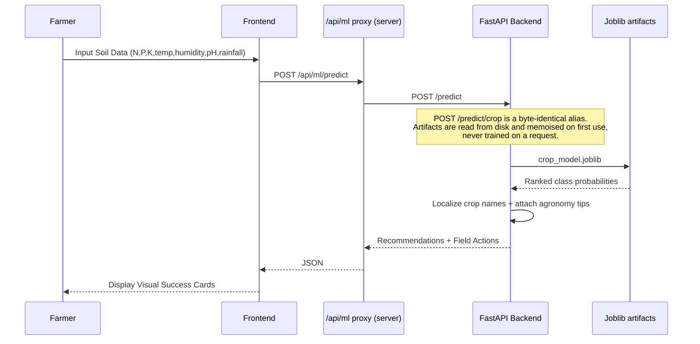

# KrishiMitra 🌾🛰️

**Empowering Indian Farmers with AI-Driven Agricultural Intelligence**

KrishiMitra is an agricultural decision support system designed to assist farmers in maximizing yield, optimizing resource usage, and navigating the complexities of modern farming. By combining machine learning, real-time data, and localized insights, it provides a "digital companion" for every step of the farming journey.

The platform has two engines:

- **Farmer advisory app** — a Next.js dashboard + FastAPI ML service (`ml-service/`) covering 13 farmer-facing modules (crop recommendation, soil health, pest detection, market prices, schemes, and more).
- **Satellite intelligence engine** — a remote-sensing ML pipeline (`satellite-ml/`) that turns optical + microwave (SAR) satellite data into **crop-type maps, phenology-aware moisture-stress maps and FAO-56 irrigation advisories** for canal command areas. See [`satellite-ml/README.md`](satellite-ml/README.md).

Both engines run **entirely offline on a laptop** (SQLite + local directories + a physically-grounded satellite simulator) and both swap to managed cloud services without a code change. See [Deploying to Google Cloud](#-deploying-to-google-cloud).

---

## 🚀 Key Modules

The platform ships **13 farmer-facing modules**, one page each, in the order they appear in the dashboard sidebar:

| # | Module | Route | What it actually does |
|---|--------|-------|------------------------|
| 1 | **Crop Intelligence** | `/dashboard/crop-intelligence` | Recommends crops from soil nutrients (N, P, K), pH, temperature, humidity and rainfall. Ensemble classifier, top-3 ranked with probabilities. |
| 2 | **Soil Health Analyzer** | `/dashboard/soil-health` | Rule-based soil scoring with nutrient alerts and corrective actions. Needs no trained model. |
| 3 | **Irrigation Planner** | `/dashboard/irrigation-planner` | Regression model that turns crop, soil moisture and weather into a dated irrigation event schedule. |
| 4 | **Fertilizer Guide** | `/dashboard/fertilizer` | Predicts an N-P-K blend plus a split-application schedule to avoid over-fertilization. |
| 5 | **Pest Detection** | `/dashboard/pest-detection` | **Text-based** symptom triage. A TF-IDF + logistic-regression classifier reads the farmer's typed symptom description and returns a likely disease, severity and preventive actions. See the note below. |
| 6 | **Weather Forecast** | `/dashboard/weather` | 1-10 day localized forecast via Open-Meteo, with agricultural advisory text. |
| 7 | **Market Prices** | `/dashboard/market-prices` | Mandi prices from the data.gov.in feed, cached, with automatic fallback to a committed sample CSV so the page is never empty. |
| 8 | **Govt Schemes** | `/dashboard/schemes` | Matches state and central schemes against the farmer's profile using the MyScheme catalogue. |
| 9 | **Tool Rental** | `/dashboard/tool-rental` | Machinery rental catalogue (tractors, tillers, harvesters) with a committed 10-entry fallback catalogue. |
| 10 | **Knowledge Base** | `/dashboard/knowledge` | Farming techniques and best practices, backed by Brave Search and Wikipedia lookups. |
| 11 | **Agri News** | `/dashboard/news` | Curated agricultural news feed from Google News RSS. May legitimately return an empty list when the upstream feed throttles. |
| 12 | **ML Models** | `/dashboard/model-insights` | Model transparency page: which algorithm won, per-model accuracy/macro-F1, feature importances, and any models that were skipped during training. |
| 13 | **Farmer History** | `/dashboard/farmer-history` | Profile management, farm records, uploads, and the full advisory history for the selected farmer. |

> **About Pest Detection.** It is a **text classifier over symptom descriptions**, not image analysis. The page lets you attach a photo and the file *is* stored against the farmer's record, but no vision model reads it — the diagnosis is produced entirely from the typed symptoms. Sending the same symptoms with and without an attached image returns a byte-identical response. Treat the upload as documentation for a human agronomist, not as model input.

---

## 🛰️ Satellite Intelligence Engine (`satellite-ml/`)

A separate, self-contained remote-sensing ML pipeline that addresses:
**AI-Driven Automated Crop Type, Moisture Stress Detection and Irrigation Advisory Across Growth Stages Using Moderate-Resolution Spectral Signatures (Optical & Microwave Satellite Data).**

It ingests multi-temporal **optical (Sentinel-2 / LISS / MODIS)** and **microwave SAR (Sentinel-1 / EOS-04)** data and produces three decision-ready map products:

1. **Crop-type map** — Random Forest / XGBoost on multi-temporal NDVI/EVI/NDWI + SAR VV/VH/RVI + GLCM texture + phenology metrics, validated with Overall Accuracy & Cohen's Kappa on a field-disjoint split.
2. **Stage-wise moisture-stress maps** — VCI (optical) + SMI (SAR soil moisture), fused and weighted by growth stage (flowering treated as most drought-sensitive).
3. **8-day irrigation advisory** — FAO-56 crop-water-deficit (ETc, root-zone water balance) translated into per-pixel irrigation-status maps for canal command-area planning.

It **runs end-to-end with zero downloads** via a physically-grounded optical+SAR simulator, and swaps to **real Sentinel-1/2 via Google Earth Engine** by changing one config line.

```bash
cd satellite-ml
python3 -m venv .venv && source .venv/bin/activate
pip install -e .                       # installs the deps AND the package
python -m krishimitra_rs.pipeline      # -> outputs/ (maps, figures, tables, model)
krishimitra-rs                         # installed console script, same pipeline

pip install -e '.[dev]'                # adds pytest + ruff
python -m pytest tests/ -v             # 13 tests, ~13s
```

No-install alternative (adds `src/` to `sys.path` for you):

```bash
cd satellite-ml
pip install -r requirements.txt
python scripts/run_pipeline.py
```

> `pip install -r requirements.txt` on its own installs the **dependencies but not the package**, so `python -m krishimitra_rs.pipeline` will then fail with `ModuleNotFoundError: No module named 'krishimitra_rs'`. Use `pip install -e .`, or use `scripts/run_pipeline.py`.

**Where outputs land.** In a source checkout (including `pip install -e .`) the pipeline always writes to `satellite-ml/outputs/`, whatever your working directory. Only a non-editable `pip install .` writes `outputs/` relative to the current directory. Point at a different scenario with `python -m krishimitra_rs.pipeline --config <path>`.

The Streamlit dashboard is an optional extra. `dashboard/app.py` bootstraps `src/` onto `sys.path` itself, so it works with or without the editable install:

```bash
pip install -e '.[dashboard]'          # or simply: pip install streamlit
streamlit run dashboard/app.py
```

Other declared extras: `gee` (real Earth Engine ingestion), `geo` (GeoTIFF outputs), `dl` (LSTM / Temporal-CNN), `texture` (faster GLCM), `all`.

### Verified pilot results

Default simulated Rabi pilot (seed 20250426, 140x140 grid, 21 × 8-day composites, 2024-11-01 → 2025-04-10), field-disjoint validation split of 1,320 train / 438 validation pixels. Regenerate with `python scripts/run_pipeline.py`; the source of truth is `satellite-ml/outputs/tables/validation_report.json`.

| Metric | Value |
|---|---|
| Best classifier | Random Forest (XGBoost runner-up: 91.8% OA, kappa 0.901) |
| Overall accuracy | **92.9%** (target: >85%) |
| Cohen's kappa | **0.915** |
| Stress vs. latent Ks correlation | **+0.40** (healthier canopy where the crop really is wetter) |
| Stress class agreement, within one class | **82.5%** |
| Advisory vs. latent Ks correlation | **-0.371** (drier ground → stronger irrigation advice) |
| Peak-demand composite | 2025-01-28 |
| Area needing irrigation | **329.2 ha** |
| Gross water demand | **261.0 ML** |
| Runtime, end to end incl. figures | **3.4 s** |

**Version sensitivity — read this before quoting the accuracy.** Those figures were measured on Python 3.13.7 with numpy 2.2.6 / scipy 1.17.1 / scikit-learn 1.7.0 / xgboost 3.2.0. A clean install that resolves to numpy 2.5.2 / scikit-learn 1.9.0 / xgboost 3.4.1 gives **93.4% OA, kappa 0.921** on the identical run. The three correlations (-0.371 / +0.40 / -0.276) are identical in both environments. Always state the environment alongside the accuracy.

Data sources (optical, SAR, ancillary, ground-truth) are documented in [`satellite-ml/DATASETS.md`](satellite-ml/DATASETS.md).

---

## 🏗️ System Architecture

The project follows a modern decoupled architecture:

### 📱 Frontend (Next.js 16)
- **Framework**: Next.js **16.3.3** (App Router, Turbopack), React 19.
- **Language**: TypeScript 5.9.
- **State Management**: Context API (Language, Farmer Session).
- **Styling**: Vanilla CSS with a "Liquid Premium" design system (dark mode by default, glassmorphism, micro-animations). There is no Tailwind dependency.
- **Internationalization**: Custom i18n system with **11 languages** — English, Hindi, Bengali, Telugu, Tamil, Marathi, Gujarati, Kannada, Malayalam, Punjabi, Odia.
- **API access**: by default the browser calls the relative path `/api/ml/*`, which a server-side route handler forwards to the FastAPI service. See [Wiring the frontend to the API](#wiring-the-frontend-to-the-api).

### ⚙️ Backend (FastAPI ML Service)
- **Framework**: FastAPI, served by Uvicorn. Requires **Python ≥ 3.13**.
- **ML Engine**: scikit-learn / LightGBM / CatBoost ensembles persisted with Joblib. 7 candidate models are trained and the best is selected automatically.
- **Data Layer**: **SQLite with WAL** locally; **Cloud SQL for PostgreSQL** when `AGROTECH_DATABASE_URL` is set. The application code is identical either way.
- **External APIs**: Open-Meteo (weather + geocoding), data.gov.in (mandi prices), Google News RSS, Brave Search + Wikipedia (knowledge), MyScheme (government schemes), and Sarvam AI's **translation** API (`mayura:v1`) for multilingual output. Every one of these degrades to committed offline data or a local dictionary when the key is absent or the provider is unreachable.

---

## 📊 Sequence Diagrams

### 1. Farmer Search & Selection
```mermaid
sequenceDiagram
    participant U as User
    participant F as Next.js UI
    participant P as /api/ml proxy (server)
    participant B as FastAPI Backend
    participant DB as SQLite / Cloud SQL

    U->>F: Enter Search Query (Name/ID/Mobile)
    Note over F: Debounced 400ms; queries under 3 chars never leave the browser
    F->>P: GET /api/ml/profiles/search?q=query&limit=8
    P->>B: GET /profiles/search?q=query&limit=8
    B->>DB: Candidate lookup (bounded, capped)
    DB-->>B: Candidate rows
    Note over B: Names match on substring; mobiles match ONLY on<br/>exact value or a >=4-digit prefix. Result set is hard-capped.
    B-->>P: JSON Result (max 20)
    P-->>F: JSON Result
    U->>F: Click "Select" on Card
    F->>F: Update FarmerSessionContext + LocalStorage
    F-->>U: Active Farmer Banner Update
```

### 2. AI Crop Prediction Flow


---

## 🛠️ Setup & Installation

### Prerequisites
- **Node.js ≥ 20.11.0** (enforced by `engines` in `package.json`; verified on v22.23.2)
- **Python ≥ 3.13** (enforced by `requires-python` in `ml-service/pyproject.toml`; verified on 3.13.7)

### 1. Backend Setup

```bash
cd ml-service
python3 -m venv .venv
source .venv/bin/activate
pip install -e .                          # there is NO requirements.txt here
python scripts/bootstrap_datasets.py      # prepares data/ (works fully offline)
agrotech-train                            # trains + writes artifacts/ (~36s)
python -m uvicorn agrotech_ml.api:app --reload --port 8000
# API available at http://localhost:8000  (docs at /docs)
```

Notes on that block, all verified on a clean virtualenv:

- **`pip install -e .` is required.** `ml-service/requirements.txt` does not exist.
- **The training entry point is `agrotech-train`**, equivalently `python -m agrotech_ml.services.train`. `python -m agrotech_ml.train` does **not** exist and raises `ModuleNotFoundError`.
- Training produces `crop_model.joblib`, `irrigation_model.joblib`, `fertilizer_model.joblib`, `disease_model.joblib` and `model_metadata.json` in `ml-service/artifacts/`, plus the SQLite database `artifacts/agrotech.db`. On the committed 2,200-row dataset the winner was **Extra Trees at 99.5% accuracy** (7 models trained, XGBoost skipped because the labels are strings).
- The API **never trains on startup or on a request**. If the artifacts are missing, startup logs an error naming them and the model-backed routes return `503` until you run `agrotech-train`.
- `agrotech-api` is the container entry point. It binds `0.0.0.0` on `$PORT` and **defaults to 8080**. The `uvicorn ... --port 8000` form above is the local-dev convention that matches the frontend's default `ML_API_URL`.

### 2. Frontend Setup

```bash
# from the repository root
npm install
npm run dev
# Dashboard available at http://localhost:3000
```

Convenience scripts from the repository root (they all assume `ml-service/.venv` exists):

```bash
npm run bootstrap:data   # ml-service dataset bootstrap
npm run dev:ml           # uvicorn with --reload on port 8000
npm run train:ml         # python -m agrotech_ml.services.train
npm run build            # production build (Next 16, Turbopack)
npm run start:standalone # serve the standalone production output
npm run lint             # eslint
npm run typecheck        # tsc --noEmit
```

### Wiring the frontend to the API

There are two mutually exclusive modes, and mixing them up is the most common deployment mistake. `.env.example` documents both.

| | **Mode A — same-origin proxy (default, recommended)** | **Mode B — direct browser calls** |
|---|---|---|
| Variable | `ML_API_URL` | `NEXT_PUBLIC_ML_API_URL` |
| Read at | **Runtime**, server-side only | **Build time**, inlined into the client bundle |
| Browser calls | `/api/ml/*` (relative, same origin) | the API URL directly |
| Change it by | setting an env var and restarting | **rebuilding the image** |
| CORS needed | No | Yes (`AGROTECH_CORS_ORIGINS` must allow the frontend origin) |
| Default | `http://127.0.0.1:8000` | unset |

Leave `NEXT_PUBLIC_ML_API_URL` unset unless you specifically need Mode B, and never point it at a localhost address for a deployed build.

---

## ☁️ Deploying to Google Cloud

Full step-by-step instructions, scripts, Terraform, cost estimates and a security checklist live in **[`docs/DEPLOY_GCP.md`](docs/DEPLOY_GCP.md)**. The shell scripts are in `deploy/` and are meant to be run in order:

```text
deploy/00-enable-apis.sh → 10-provision.sh → 20-secrets.sh → 30-deploy.sh → 40-satellite-job.sh (optional)
```

All of them are idempotent, all confirm before acting, and none has a destructive default.

### Local vs. GCP — the same code, two backends

The service reads its whole environment from `AGROTECH_*` variables. **With none of them set you get the fully local mode**, which is what every command in this README uses.

| Concern | Local (no env vars set) | Google Cloud |
|---|---|---|
| Database | SQLite + WAL at `ml-service/artifacts/agrotech.db` | Cloud SQL for PostgreSQL via `AGROTECH_DATABASE_URL` |
| Model artifacts | `ml-service/artifacts/` on disk | GCS bucket, synced at startup via `AGROTECH_MODELS_GCS_URI` |
| Farmer uploads | `ml-service/uploads/` on disk | GCS bucket via `AGROTECH_UPLOADS_GCS_BUCKET` |
| Satellite outputs | `satellite-ml/outputs/` on disk | GCS bucket mounted at `/app/outputs` in a Cloud Run Job |
| Secrets | `.env` / shell environment | Secret Manager |
| Frontend → API | `ML_API_URL=http://127.0.0.1:8000` | `ML_API_URL=https://<api>.run.app` on the web revision |

The cloud dependencies are an **optional extra**, so a local install stays light:

```bash
pip install -e .            # local: SQLite + local directories
pip install -e '.[cloud]'   # adds psycopg + google-cloud-storage
```

A Cloud SQL connection string uses a Unix socket and has an **empty host before the slash** — this trips people up:

```text
postgresql://USER:PASS@/DBNAME?host=/cloudsql/PROJECT:REGION:INSTANCE
```

Container images build from the **repository root**, except the satellite image which builds from `satellite-ml/`:

```bash
docker build -f Dockerfile.api -t krishimitra-api .
docker build -f Dockerfile.web -t krishimitra-web .
docker build -t krishimitra-satellite satellite-ml/
```

Rough cost for a small pilot (~500 farmers, ~50k requests/month, `asia-south1`, `min-instances=0`): **≈ USD 37/month**, of which Cloud SQL `db-g1-small` is about 85%. Cloud Run itself lands near zero because the workload fits the free tier. Raising `API_MIN_INSTANCES` to 1 at 2 vCPU / 2 GiB adds roughly USD 50-60/month. Always sanity-check against the [Google Cloud pricing calculator](https://cloud.google.com/products/calculator).

---

## 📂 Project Structure

```text
KrishiMitra/
├── app/                  # Next.js App Router
│   ├── api/health/       # frontend liveness probe
│   ├── api/ml/[...path]/ # server-side proxy to the FastAPI service
│   └── dashboard/        # the 13 farmer-facing module pages
├── components/           # UI Components (Atomic Design)
│   ├── farmers/          # Farmer-specific UI (Banner, Search)
│   ├── navigation/       # DashboardShell + sidebar
│   ├── pages/            # Page-level complex components
│   └── ui/               # Reusable base components (incl. AsyncState)
├── contexts/             # React Context Providers (Session, Language)
├── lib/                  # api · constants · errors · hooks · i18n · types
├── ml-service/           # FastAPI farmer-advisory backend (Python >= 3.13)
│   ├── src/agrotech_ml/  # api · core · cloud · db · models · services
│   ├── scripts/          # dataset bootstrap
│   ├── data/             # committed datasets + offline fallbacks
│   ├── artifacts/        # trained models + SQLite DB (gitignored)
│   └── uploads/          # farmer-submitted files (gitignored)
├── satellite-ml/         # 🛰️ Remote-sensing ML engine (crop/stress/irrigation)
│   ├── config/           # pilot_area.yaml — crops, FAO-56 Kc, season, AOI
│   ├── src/krishimitra_rs/
│   │   ├── data/         # simulate + Google Earth Engine ingestion
│   │   ├── features/     # indices · texture · phenology
│   │   ├── models/       # crop classifier (RF/XGB) · moisture stress
│   │   ├── advisory/     # growth-stage Kc · FAO-56 water balance · irrigation
│   │   ├── validation/   # OA · kappa · credibility checks
│   │   └── viz/          # colour-coded maps + time-series
│   ├── dashboard/        # Streamlit dashboard
│   ├── notebooks/        # walkthrough notebook
│   └── tests/            # pytest suite (13 tests)
├── deploy/               # GCP provisioning + deployment scripts, Terraform
├── docs/DEPLOY_GCP.md    # the Google Cloud runbook
├── Dockerfile.api        # FastAPI image   (context: repo root)
├── Dockerfile.web        # Next.js image   (context: repo root)
├── cloudbuild.yaml       # Cloud Build pipeline
└── docker-compose.yml    # local stack: db · api · web · satellite
```

---

## ⚠️ Known Limitations

Stated plainly, because a README that hides these costs more time than it saves.

**Not verified end to end**

- **The container images have never been built successfully.** `docker build -f Dockerfile.api .`, `docker build -f Dockerfile.web .` and the satellite image were all blocked by a sandbox with no container-registry access. Their syntax, build contexts, `.dockerignore` coverage and structure were validated offline, but Python/Node dependency resolution *inside* the images is unproven. Build all three before trusting them.
- **The PostgreSQL path has never run against a real PostgreSQL server.** It was verified through the dialect layer's generated SQL, a fake `psycopg` driver recording every statement (30/30 checks), and the SQLite→Postgres migrator against a real PostgreSQL 18 instance (17/17). Live DDL acceptance and real type round-tripping remain untested. Do one dry run against a real instance before the first production cutover.
- **Nothing has been executed against a real GCP project.** Every `gcloud` invocation in `deploy/` and `docs/DEPLOY_GCP.md` is unexecuted; flags were checked against current Google documentation rather than run. `terraform validate` has also never been run (Terraform is not installed here), though all four `.tf` files parse and pass a semantic check.

**Known functional gaps**

- **Pest Detection does not look at images.** See the note in [Key Modules](#-key-modules).
- **Audit logging is advertised but never written.** The `audit_logs` table is created, `save_audit_log()` exists, and `/dashboard/summary` reports `audit_logging_enabled: true`, but no code path inserts a row.
- **`GET /news/feed` intermittently returns `[]`.** Google News RSS throttles; this is upstream, reproduces with a bare `curl`, and never 500s. There is deliberately no stale-news fallback.
- **Only English and Hindi are fully translated.** The other 9 languages fall back to the English string for newer UI keys. Accurate Bengali/Telugu/Tamil/Marathi/Gujarati/Kannada/Malayalam/Punjabi/Odia copy needs a native speaker.
- **No PostgreSQL connection pooling.** Every call opens its own connection, exactly as the SQLite code did. Correct, but chatty against Cloud SQL under load.
- **Dead CSS utility classes.** Many Tailwind-style class names (`flex`, `mt-4`, `grid-cols-2`, …) appear in the components, but the project has no Tailwind dependency and `app/globals.css` is hand-written, so they are inert. Cosmetic and pre-existing; layout is unaffected.
- **`npm start` (plain `next start`) prints a warning** because the build uses `output: 'standalone'`. It still serves correctly. `npm run start:standalone` is the supported production entry point.

**Security items that need a human**

- **The MyScheme API key is compromised.** It is committed in git history (`b119cb8`) and is still hardcoded in `ml-service/src/agrotech_ml/services/data_service.py`. Rotate it at the provider, land the code fix that reads it from `settings.myscheme_api_key`, and decide separately whether to scrub git history.
- **A farmer-submitted upload is tracked in git**: `ml-service/uploads/759ccdb7-c7da-4dd2-a03f-368d447c63ea.jpg`. Adding `uploads/*` to `.gitignore` does not untrack an already-committed file; it needs `git rm --cached`.
- **`.gitignore` does not cover the deploy secrets.** Add `deploy/env`, `deploy/terraform/*.tfvars`, `deploy/terraform/*.tfstate*` and `deploy/terraform/.terraform/`. The existing `.env` / `.env.*` rules do not match a file literally named `deploy/env`, and **Terraform state contains the generated database password in plaintext**.
- **`GET /static/uploads/{name}` is auth-gated in production.** It replaced the old static mount and serves files as inert attachments. Asset URLs are no longer anonymously readable — update any client that assumed they were.

---

## 🛡️ License
Built with ❤️ for the Indian Farming Community. All Rights Reserved.
