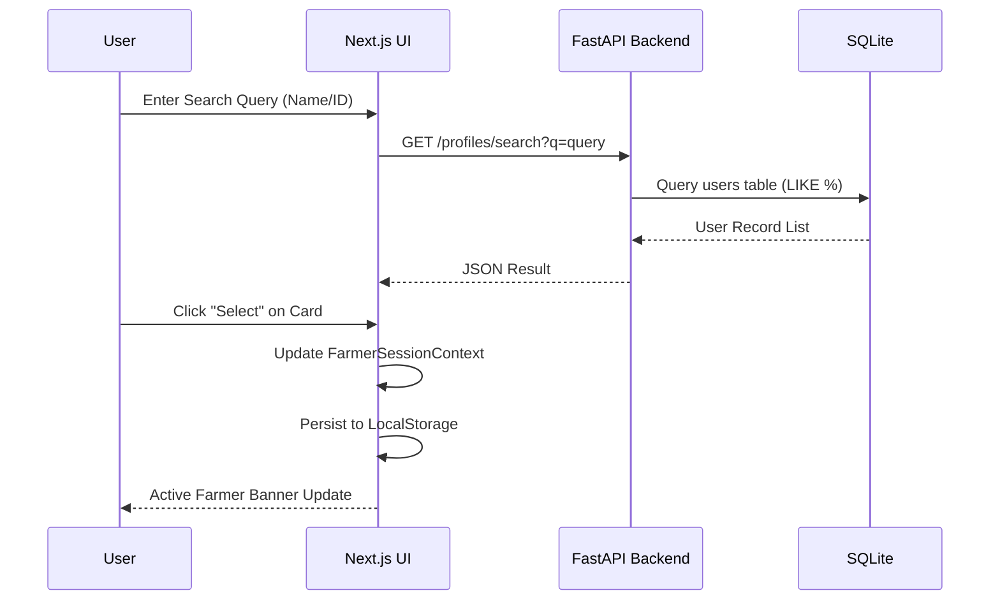
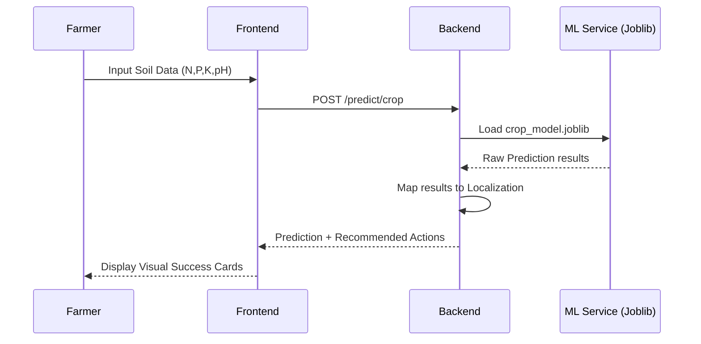

# KrishiMitra 🌾🛰️

**Empowering Indian Farmers with AI-Driven Agricultural Intelligence**

KrishiMitra is a state-of-the-art agricultural decision support system designed to assist farmers in maximizing yield, optimizing resource usage, and navigating the complexities of modern farming. By combining machine learning, real-time data, and localized insights, it provides a "digital companion" for every step of the farming journey.

The platform has two engines:

- **Farmer advisory app** — a Next.js dashboard + FastAPI ML service (`ml-service/`) covering 13 farmer-facing modules (crop recommendation, soil health, pest detection, market prices, schemes, and more).
- **Satellite intelligence engine** — a remote-sensing ML pipeline (`satellite-ml/`) that turns optical + microwave (SAR) satellite data into **crop-type maps, phenology-aware moisture-stress maps and FAO-56 irrigation advisories** for canal command areas. See [`satellite-ml/README.md`](satellite-ml/README.md).

---

## 🚀 Key Modules

The platform is organized into **13 specialized modules**, each addressing a critical aspect of agriculture:

1.  **Crop Intelligence**: Recommends the most suitable crops based on soil nutrients (N, P, K), pH, and weather patterns.
2.  **Soil Health Analyzer**: Deep analysis of soil composition with actionable recommendations for soil improvement.
3.  **Irrigation Planner**: Optimizes water usage by calculating irrigation needs based on soil moisture and crop type.
4.  **Fertilizer Guide**: Precise fertilizer dosage recommendations to prevent over-fertilization and reduce costs.
5.  **Pest Detection**: AI-powered image analysis to identify pests and diseases in crops (using local ML models).
6.  **Weather Forecast**: Multi-day localized forecasts with hyper-local agricultural advisory.
7.  **Market Prices**: Real-time tracking of crop prices across various Indian Mandis (Markets).
8.  **Govt Schemes**: Automated matching of state and central government schemes based on the farmer's profile.
9.  **Tool Rental**: A peer-to-peer marketplace for renting agricultural machinery like tractors and tillers.
10. **Knowledge Base**: A comprehensive library of farming techniques, best practices, and regional wisdom.
11. **Agricultural News**: Curated news feed relevant to regional and national agricultural shifts.
12. **Farmer Portal**: Robust profile management, historical record tracking, and multi-user selection.
13. **AI Advisor**: Multi-lingual conversational AI that answers farming queries using LLM integration.

---

## 🛰️ Satellite Intelligence Engine (`satellite-ml/`)

A separate, self-contained remote-sensing ML pipeline that addresses:
**AI-Driven Automated Crop Type, Moisture Stress Detection and Irrigation Advisory Across Growth Stages Using Moderate-Resolution Spectral Signatures (Optical & Microwave Satellite Data).**

It ingests multi-temporal **optical (Sentinel-2 / LISS / MODIS)** and **microwave SAR (Sentinel-1 / EOS-04)** data and produces three decision-ready map products:

1. **Crop-type map** — Random Forest / XGBoost on multi-temporal NDVI/EVI/NDWI + SAR VV/VH/RVI + GLCM texture + phenology metrics, validated with Overall Accuracy & Cohen's Kappa (≈93% OA on the demo pilot, target >85%).
2. **Stage-wise moisture-stress maps** — VCI (optical) + SMI (SAR soil moisture), fused and weighted by growth stage (flowering treated as most drought-sensitive).
3. **8-day irrigation advisory** — FAO-56 crop-water-deficit (ETc, root-zone water balance) translated into per-pixel irrigation-status maps for canal command-area planning.

It **runs end-to-end with zero downloads** via a physically-grounded optical+SAR simulator, and swaps to **real Sentinel-1/2 via Google Earth Engine** by changing one config line.

```bash
cd satellite-ml
pip install -r requirements.txt
python -m krishimitra_rs.pipeline      # -> outputs/ (maps, figures, tables, model)
streamlit run dashboard/app.py         # interactive dashboard
```

Data sources (optical, SAR, ancillary, ground-truth) are documented in [`satellite-ml/DATASETS.md`](satellite-ml/DATASETS.md).

---

## 🏗️ System Architecture

The project follows a modern decoupled architecture:

### 📱 Frontend (Next.js 15)
- **Framework**: Next.js 15 (App Router)
- **Language**: TypeScript
- **State Management**: Context API (Language, Farmer Session)
- **Styling**: Vanilla CSS with a "Liquid Premium" design system (Dark mode by default, glassmorphism, micro-animations).
- **Internationalization**: Custom i18n system supporting English, Hindi, Bengali, and Telugu.

### ⚙️ Backend (FastAPI ML Service)
- **Framework**: FastAPI (Python)
- **ML Engine**: Scikit-Learn models served via Joblib.
- **Data Layer**: SQLite with WAL (Write-Ahead Logging) for concurrent access.
- **External APIs**: Integration with Sarvam AI (for Multi-lingual LLM support) and Brave Search.

---

## 📊 Sequence Diagrams

### 1. Farmer Registration & Selection


### 2. AI Crop Prediction Flow


---

## 🛠️ Setup & Installation

### Prerequisites
- Node.js (v18+)
- Python (3.9+)

### 1. Frontend Setup
```bash
# Navigate to project root
npm install
npm run dev
# Dashboard available at http://localhost:3000
```

### 2. Backend Setup
```bash
cd ml-service
python -m venv .venv
source .venv/bin/activate
pip install -r requirements.txt
python -m agrotech_ml.api
# API available at http://localhost:8000
```

---

## 📂 Project Structure

```text
KrishiMitra/
├── app/                  # Next.js App Router (Pages/Routing)
├── components/           # UI Components (Atomic Design)
│   ├── farmers/          # Farmer-specific UI (Banner, Search)
│   ├── ui/               # Reusable base components
│   └── pages/            # Page-level complex components
├── contexts/             # React Context Providers (Session, Language)
├── lib/                  # Utilities (API, Types, i18n)
├── ml-service/           # FastAPI farmer-advisory backend
│   ├── src/agrotech_ml/  # Core backend logic (api, db, services)
│   └── scripts/          # Model training and data prep
└── satellite-ml/         # 🛰️ Remote-sensing ML engine (crop/stress/irrigation)
    ├── config/           # pilot_area.yaml — crops, FAO-56 Kc, season, AOI
    ├── src/krishimitra_rs/
    │   ├── data/         # simulate + Google Earth Engine ingestion
    │   ├── features/     # indices · texture · phenology
    │   ├── models/       # crop classifier (RF/XGB) · moisture stress
    │   ├── advisory/     # growth-stage Kc · FAO-56 water balance · irrigation
    │   ├── validation/   # OA · kappa · credibility checks
    │   └── viz/          # colour-coded maps + time-series
    ├── dashboard/        # Streamlit dashboard
    └── tests/            # pytest suite
```

---

## 🛡️ License
Built with ❤️ for the Indian Farming Community. All Rights Reserved.
