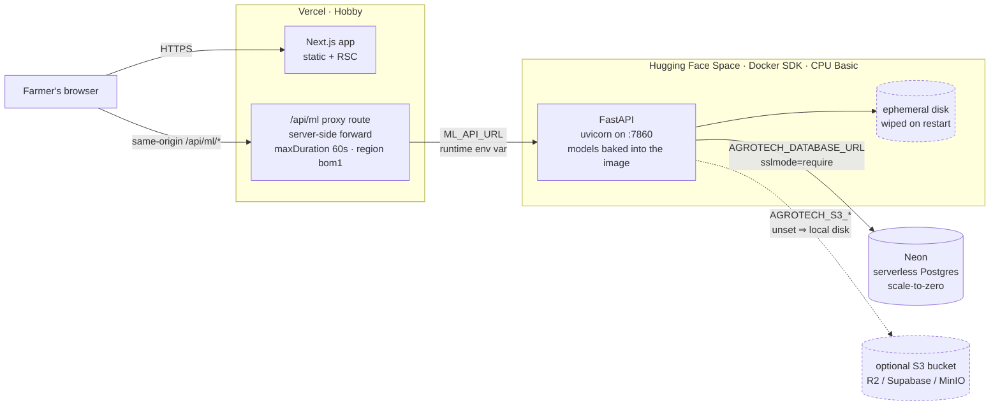

# Deploying KrishiMitra on the free stack

Three managed services, no servers to run, no credit card required for the hosting
itself:

| Layer | Host | What runs there |
| --- | --- | --- |
| Frontend | **Vercel** (Hobby) | the Next.js 16 app, built natively — no Dockerfile |
| API | **Hugging Face Space** (Docker SDK) | the FastAPI ML service, `spaces/api/Dockerfile` |
| Database | **Neon** | serverless Postgres, scale-to-zero |
| Uploads | *optional* S3-compatible bucket | Cloudflare R2 / Supabase / Backblaze / MinIO |

Everything below has a local equivalent that needs none of it — see
[Local-only](#local-only-no-accounts-at-all) at the end. That path is not a downgrade
path bolted on afterwards; it is the default the code is written against.

> **One honest caveat before you start.** Hugging Face's docs state that Gradio and
> Docker Spaces "require a paid plan to create: PRO for personal accounts, Team or
> Enterprise for organizations". The CPU Basic **hardware** is free (no hourly cost),
> but creating the Docker Space on a personal account currently needs
> [PRO — $9/month](https://huggingface.co/pricing). So this stack is $0/month for
> Vercel and Neon, and $0/month of *compute* on Hugging Face, but not necessarily $0
> of *subscription*. If that is a blocker, the same image runs unchanged anywhere that
> injects `PORT` — see [If you cannot use a Space](#if-you-cannot-use-a-space).

---

## Architecture



Two properties of this shape are worth stating explicitly, because they are what make
the free tier survivable:

1. **The browser never talks to the API host.** It calls the relative path `/api/ml/*`
   on its own origin; the Next.js route handler forwards server-side to `ML_API_URL`.
   No CORS, no API hostname in the shipped JavaScript, and repointing the backend is an
   env-var edit rather than a rebuild.
2. **Nothing durable lives on the API host.** Rows go to Neon, uploads go to S3 (or are
   accepted as disposable). The Space's disk is scratch space, by design, because
   Hugging Face wipes it on every restart.

---

## Step 0 — prerequisites

```bash
git lfs install                       # brew install git-lfs / apt install git-lfs
npm i -g vercel                       # optional; the web UI works too
pip install -U "huggingface_hub[cli]" # optional; git push works too
npm run train:ml                      # produce ml-service/artifacts/*.joblib (~170 MB)
```

Accounts: [neon.com](https://neon.com), [huggingface.co](https://huggingface.co),
[vercel.com](https://vercel.com).

---

## Step 1 — Neon (database)

1. **Create a project.** neon.com → *New Project*. Pick the region closest to your
   users — `aws-ap-south-1` (Mumbai) for India. Postgres 17 to match local compose.
2. **Copy the connection string.** Dashboard → *Connect*. You want the **pooled**
   string (host contains `-pooler`), which suits a request-per-connection API:

   ```
   postgresql://<user>:<password>@ep-xxxx-pooler.ap-south-1.aws.neon.tech/neondb?sslmode=require
   ```

   `?sslmode=require` is **not optional** — Neon refuses unencrypted connections, and
   dropping it produces a connection error that reads like a network fault.
3. **Nothing else.** No schema step: the API runs `CREATE TABLE IF NOT EXISTS` at
   startup (`agrotech_ml.db.storage.init_db`), so the first boot against an empty
   database creates everything.

Keep the string somewhere safe; it is the value of `AGROTECH_DATABASE_URL` in Step 3.

---

## Step 2 — migrate existing SQLite data (skip for a fresh install)

Local development writes to `ml-service/artifacts/agrotech.db`. To carry that data over:

```bash
# 1. create the schema in Neon by starting the API against it once
export AGROTECH_DATABASE_URL="postgresql://...?sslmode=require"
cd ml-service && ./.venv/bin/python -c \
  "from agrotech_ml.core.settings import get_settings; get_settings()" && cd ..

# 2. see what would move — writes nothing
python scripts/sqlite_to_postgres.py \
  --sqlite ml-service/artifacts/agrotech.db --dry-run

# 3. move it
python scripts/sqlite_to_postgres.py \
  --sqlite ml-service/artifacts/agrotech.db
```

The script needs a Postgres driver (`pip install "psycopg[binary]"`). It reads the
SQLite file read-only, copies only columns that exist in both schemas, uses
`ON CONFLICT DO NOTHING` so re-runs are safe, and commits one transaction per table. It
never deletes anything unless you pass `--truncate`, which asks for confirmation.

`python scripts/sqlite_to_postgres.py --help` documents the rest.

---

## Step 3 — API on a Hugging Face Space

Full detail in [`spaces/api/DEPLOY.md`](../spaces/api/DEPLOY.md). The short version:

```bash
# create the Space (SDK: Docker, hardware: CPU basic) at huggingface.co/new-space, then
git clone https://huggingface.co/spaces/<user>/<space> ../krishimitra-space
./spaces/api/sync.sh ../krishimitra-space --with-artifacts
cd ../krishimitra-space && git push origin main
```

`sync.sh` assembles the Space repo from this one: `Dockerfile` at the root (Hugging
Face only reads that exact name), the HF `README.md` front-matter, git-lfs rules, and
the `ml-service/` subset — without the Next.js app, `node_modules`, `agrotech.db` or
user uploads.

Then set the Space **secrets** (Settings → *Variables and secrets*):

| Name | Value |
| --- | --- |
| `AGROTECH_DATABASE_URL` | the Neon string from Step 1 |
| `AGROTECH_JWT_SECRET` | `openssl rand -hex 32` |
| `AGROTECH_ENVIRONMENT` | `production` |
| `AGROTECH_PUBLIC_BASE_URL` | `https://<user>-<space>.hf.space` |
| `AGROTECH_SARVAM_API_KEY`, `AGROTECH_BRAVE_SEARCH_API_KEY`, `AGROTECH_MYSCHEME_API_KEY` | optional; each feature degrades gracefully when unset |
| `AGROTECH_S3_*` | optional; see [Uploads](#uploads-and-the-ephemeral-disk) |

Verify:

```bash
curl https://<user>-<space>.hf.space/health
```

---

## Step 4 — frontend on Vercel

1. **Import the repo.** vercel.com → *Add New Project* → import from GitHub. Framework
   preset **Next.js** is detected; leave build and output settings alone. `vercel.json`
   already pins `regions: ["bom1"]`.
2. **Set one environment variable** (Project → Settings → Environment Variables), for
   Production *and* Preview:

   ```
   ML_API_URL = https://<user>-<space>.hf.space
   ```

   No trailing slash, no `/api` suffix.
3. **Leave `NEXT_PUBLIC_ML_API_URL` UNSET.** This matters more than it looks.
   `NEXT_PUBLIC_*` values are inlined into the client bundle at build time, so setting
   it would bake the API origin into every visitor's JavaScript: repointing the backend
   would then require a full rebuild and redeploy, the Space would need
   `AGROTECH_CORS_ORIGINS` and would pay a preflight on every call, and a stale value
   would break the app for everyone until the next build. Left unset, the browser uses
   the same-origin proxy and `ML_API_URL` alone decides where requests go — editable in
   the dashboard, effective on the next deploy, no source change.
4. **Deploy**, then check `https://<project>.vercel.app/api/health`.

`output: "standalone"` in `next.config.ts` is switched off automatically on Vercel
(`VERCEL=1`); it exists for the Docker/self-hosted path only. Nothing to configure.

---

## Free-tier limits, and what they actually cost you

### Hugging Face Space (CPU Basic)

| Limit | Consequence |
| --- | --- |
| 2 vCPU, 16 GB RAM | Plenty. The ensembles load in ~200 MB per worker; `WEB_CONCURRENCY=1` is the sane default. |
| **50 GB disk, ephemeral** | Everything written inside the container is lost on every restart and rebuild. Uploaded images vanish. This is the single most surprising property of the platform, and the reason the optional S3 backend exists. |
| **Sleeps when unused** | The first request after an idle period cold-starts the container: expect ~30 s or more. The proxy waits up to 50 s for response headers and then returns a 504 with a "still waking up" message rather than hanging. Users see a slow first load, not an error page — but it is slow. |
| No hourly cost | The hardware is genuinely free. **Creating** a Docker Space on a personal account requires PRO ($9/month) per HF's current docs. |
| Persistent storage | Only via paid Storage Buckets. Use S3 instead — the free tiers of R2/Supabase are more generous. |

### Neon (Free plan)

| Limit | Consequence |
| --- | --- |
| 0.5 GB storage per project | Fine for rows; do not put images in the database. Advisory history for tens of thousands of farms fits comfortably. |
| 100 CU-hours per project/month | ≈400 hours of a 0.25 CU (1 GB) compute. With scale-to-zero, a low-traffic app uses a fraction of it. |
| Scale-to-zero after 5 min idle, **cannot be disabled** | Adds a few hundred ms to the first query after idle — noticeable, but an order of magnitude less than the Space's cold start. |
| No idle-pause of the *project* | Unlike some free tiers, Neon does not suspend or delete a project for being quiet. If you exceed the monthly quota the compute suspends until the window resets; **your data is never deleted**. |
| 5 GB egress/month, 10 branches, 100 projects | Not a practical constraint here. |

### Vercel (Hobby)

| Limit | Consequence |
| --- | --- |
| **Non-commercial, personal use only** | This is a licence term, not a technical one. Ads, payments, or running it as a business on Hobby violates the Terms. A commercial deployment needs Pro ($20/user/month). |
| **4.5 MB request/response body** | Uploads pass through a Vercel Function, so an unresized phone photo can be rejected with `413` before the app's code runs. Resize client-side, or point that one call directly at the Space (Mode B in `.env.example`). |
| 300 s max function duration (Hobby default and max) | Not binding: the proxy sets `maxDuration = 60`. |
| 100 GB fast data transfer, 1M function invocations, 1M edge requests, 6,000 build minutes/month | Generous for this workload. Static assets are served from the CDN and do not invoke functions. |
| 2 GB memory / 1 vCPU per function | The proxy streams and buffers nothing; irrelevant here. |

### Uploads and the ephemeral disk

With `AGROTECH_S3_*` unset the API writes uploads to its own disk — correct locally,
lossy on a Space. To keep them, create a bucket on any S3-compatible service
(Cloudflare R2's free tier is 10 GB storage with no egress fee) and set as Space
secrets:

```
AGROTECH_S3_ENDPOINT_URL      https://<accountid>.r2.cloudflarestorage.com
AGROTECH_S3_BUCKET            krishimitra-uploads
AGROTECH_S3_ACCESS_KEY_ID     ...
AGROTECH_S3_SECRET_ACCESS_KEY ...
AGROTECH_S3_PUBLIC_BASE_URL   https://uploads.example.com   # optional, for public URLs
AGROTECH_S3_REGION            auto                          # R2 wants "auto"
```

All unset ⇒ local disk. Partially set ⇒ still local disk; the code requires the whole
set before it switches backends.

---

## What $0/month buys, and what it does not

| Component | Free tier | Cost | What you give up versus paid |
| --- | --- | --- | --- |
| Vercel Hobby | 100 GB transfer, 1M invocations | **$0** | Commercial use (Pro $20/user/mo), team members, multi-region functions, >4.5 MB bodies |
| Hugging Face Space, CPU Basic | 2 vCPU / 16 GB / 50 GB ephemeral | **$0 of compute** (Docker Space creation needs PRO, $9/mo) | Always-on (paid hardware never sleeps), persistent Storage Buckets, more vCPU |
| Neon Free | 0.5 GB, 100 CU-hours | **$0** | Storage beyond 0.5 GB, always-on compute, PITR beyond 24 h, more branches (Launch $19/mo) |
| Cloudflare R2 (optional) | 10 GB, no egress fee | **$0** | Nothing that matters at this scale |
| **Total** | | **$0/month hosting** (+ $9/mo HF PRO if your account needs it to create the Space) | Cold starts, ephemeral disk, non-commercial licence, 0.5 GB of database |

The three things you are actually trading away: **cold starts** (~30 s after idle),
**an ephemeral API disk** (solved by S3, or accepted), and **the Hobby licence**
(personal, non-commercial). None of them is a code change — they are all reversible by
paying, on any of the three services independently.

---

## Local-only (no accounts at all)

Two ways, both fully functional and neither requiring a single cloud account.

**Zero-config — no containers, no environment variables:**

```bash
npm install
npm run dev        # frontend  → http://localhost:3000
npm run dev:ml     # API       → http://localhost:8000  (SQLite + local directories)
```

The API falls back to SQLite at `ml-service/artifacts/agrotech.db` and local upload
directories whenever `AGROTECH_DATABASE_URL` and `AGROTECH_S3_*` are unset. That is the
default, and it is the mode the code is written against — not an afterthought.

**Production parity — the same images, with Postgres:**

```bash
docker compose up --build
#   web   http://localhost:3000
#   api   http://localhost:8080/health
#   db    127.0.0.1:5432   (agrotech / agrotech_local_dev_only)
docker compose down       # keep data
docker compose down -v    # delete the local database volume
```

Compose builds the API from `spaces/api/Dockerfile` — the exact image the Space runs —
and the frontend from `Dockerfile.web`. The satellite pipeline is available too:

```bash
docker compose --profile satellite run --rm satellite            # offline simulation
docker compose --profile satellite run --rm satellite --source gee
```

---

## If you cannot use a Space

`spaces/api/Dockerfile` contains no Hugging Face-specific instruction: it reads `PORT`,
runs as UID 1000, writes only inside its own directory, and needs no build-time
secrets. Any host that builds a Dockerfile and injects `PORT` runs it as-is. Only the
YAML front-matter in `spaces/api/README.md` is HF-specific, and other hosts ignore it.

Whatever you pick, the frontend side is unchanged: point `ML_API_URL` at the new URL
in Vercel and redeploy. That is the whole cutover — which is exactly why
`NEXT_PUBLIC_ML_API_URL` stays unset.

---

## Troubleshooting

| Symptom | Cause and fix |
| --- | --- |
| `/api/ml/*` returns 504 on the first request | The Space is cold-starting. Retry; consider a keep-warm ping if it becomes annoying. |
| API logs show SQLite in production | `AGROTECH_DATABASE_URL` is unset or malformed on the Space. Check for a missing `?sslmode=require`. |
| Uploads work, then disappear | Expected — ephemeral disk. Configure `AGROTECH_S3_*`. |
| `413` on image upload | Vercel's 4.5 MB body limit on the proxy hop. Resize client-side, or use Mode B for that call. |
| Frontend calls `localhost` in production | `NEXT_PUBLIC_ML_API_URL` was set at build time. Unset it and redeploy. |
| Neon `too many connections` | Use the **pooled** connection string (host contains `-pooler`). |
| Space build fails on `COPY ml-service/...` | `sync.sh` was not run, or `Dockerfile` is not at the Space repo root. |

## See also

- [`spaces/api/DEPLOY.md`](../spaces/api/DEPLOY.md) — the API deployment in detail
- [`.env.example`](../.env.example) — frontend variables
- [`ml-service/.env.example`](../ml-service/.env.example) — API variables
- [`docker-compose.yml`](../docker-compose.yml) — the local stack
