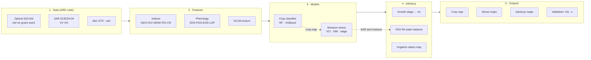

# KrishiMitra-RS 🛰️🌾

**AI-driven crop-type mapping, phenology-aware moisture-stress detection and
FAO-56 irrigation advisory from moderate-resolution optical + microwave (SAR)
satellite data.**

This is the remote-sensing engine of KrishiMitra. It turns a season of
Sentinel-2 (optical) and Sentinel-1 (SAR) observations over a **canal command
area** into three decision-ready map products:

1. a **crop-type map** (Random Forest / XGBoost on multi-temporal signatures),
2. **stage-wise moisture-stress maps** (VCI + SAR soil-moisture, weighted by
   growth stage), and
3. an **8-day irrigation advisory** (FAO-56 crop water deficit → action per pixel).

It runs **end-to-end out of the box** on a physically-grounded synthetic pilot
(no downloads, no GPU) and swaps to **real Sentinel-1/2 via Google Earth Engine**
by changing one config line.

---

## Why two data paths?

| Path | Command | Needs | Use |
|------|---------|-------|-----|
| **Simulated** (default) | `python -m krishimitra_rs.pipeline` | nothing beyond the core deps | demo / hackathon / CI — reproducible, runs anywhere |
| **Real (GEE)** | set `data.source: gee` + AOI, then run | `earthengine-api`, EE account | a real pilot command area |

The simulator is not decorative: it runs a real FAO-56 water balance with
canal-limited irrigation so the crop, stress and advisory layers are internally
consistent and checkable against a known truth — which is how the pipeline
*validates itself* (see below).

---

## Pipeline architecture



Cleanly layered so each stage is independently testable and swappable:
`data → features → models → advisory → validation → viz`.

---

## How it maps to the problem statement

| Brief requirement | Where it lives |
|---|---|
| Multi-temporal crop-type classification (RF / XGBoost) | [`models/crop_classifier.py`](src/krishimitra_rs/models/crop_classifier.py) |
| Optical indices NDVI / EVI / NDWI | [`features/indices.py`](src/krishimitra_rs/features/indices.py) |
| SAR features VV / VH / ratio (RVI, CR) | [`features/indices.py`](src/krishimitra_rs/features/indices.py) |
| GLCM texture | [`features/texture.py`](src/krishimitra_rs/features/texture.py) |
| Phenology metrics (SOS / peak / LGP) | [`features/phenology.py`](src/krishimitra_rs/features/phenology.py) |
| Stage-wise moisture stress (VCI, SMI, VCI-bins) | [`models/stress.py`](src/krishimitra_rs/models/stress.py) |
| Phenology-aware growth stages | [`features/phenology.py`](src/krishimitra_rs/features/phenology.py) · [`advisory/phenology_stage.py`](src/krishimitra_rs/advisory/phenology_stage.py) |
| 8-day crop water deficit (ETc, water balance) | [`advisory/water_balance.py`](src/krishimitra_rs/advisory/water_balance.py) |
| Irrigation advisory maps | [`advisory/irrigation.py`](src/krishimitra_rs/advisory/irrigation.py) |
| Validation: Overall Accuracy, Kappa | [`models/crop_classifier.py`](src/krishimitra_rs/models/crop_classifier.py) · [`validation/metrics.py`](src/krishimitra_rs/validation/metrics.py) |
| LSTM / Temporal-CNN | [`models/temporal_dl.py`](src/krishimitra_rs/models/temporal_dl.py) (optional) |
| Real ingestion (S1/S2/MODIS via GEE) | [`data/gee_ingest.py`](src/krishimitra_rs/data/gee_ingest.py) |
| Dashboard / time-series visualisation | [`dashboard/app.py`](dashboard/app.py) · [`viz/maps.py`](src/krishimitra_rs/viz/maps.py) |

---

## Quickstart

```bash
cd satellite-ml
python -m venv .venv && source .venv/bin/activate
pip install -r requirements.txt          # core deps only — runs the full pipeline

python -m krishimitra_rs.pipeline         # ~3 s on a laptop
# or:  python scripts/run_pipeline.py
```

Outputs land under `outputs/`:

```
outputs/
├── maps/       crop_type_map.png · moisture_stress_map.png · irrigation_advisory_map.png (+ .tif)
├── figures/    phenology_curves.png · timeseries_panels.png · confusion_matrix.png
├── tables/     run_summary.json · validation_report.json · per_crop_area.csv
└── models/     crop_classifier.joblib
```

Interactive dashboard:

```bash
pip install streamlit
streamlit run dashboard/app.py
```

---

## Representative results (default simulated pilot, seed 20250426)

| Metric | Value |
|---|---|
| Crop classification — **Overall Accuracy** | **≈ 93 %** (target: > 85 %) |
| Crop classification — **Cohen's κ** | **≈ 0.92** |
| Best model | Random Forest (XGBoost within ~1 pt) |
| Train / val split | **field-disjoint** (no field spans both sets) |
| Stress condition vs. latent truth (corr) | ≈ 0.4, within-1-class agreement ≈ 0.83 |
| Advisory vs. latent truth (corr) | ≈ −0.44 (more water advised where genuinely drier) |

The confusion that remains is agronomically sensible — e.g. Mustard ↔ Gram, two
low-biomass Rabi crops — which is exactly what a *credible* (not suspiciously
perfect) result looks like.

> **Why not 100 %?** Because every field of a crop is given realistic per-field
> variation in sowing date, vigour and canopy structure. Identical signatures
> would inflate accuracy to a meaningless 100 %.

---

## Methodology notes (defensible choices)

- **Field-disjoint validation.** Ground-truth pixels are split so whole *fields*
  go to train or validation, never both — the honest way to avoid
  spatial-autocorrelation leakage that otherwise inflates accuracy.
- **VCI (single-season surrogate).** Classic VCI needs a multi-year NDVI archive;
  with one season we compare each pixel to its **crop-and-date cohort** (healthy
  peers of the same crop on the same date). The multi-year formula is a drop-in
  once an archive exists.
- **SAR for soil moisture (all-weather).** VV backscatter drives the Soil-Moisture
  Index and anchors the water balance — the layer that survives monsoon cloud
  when optical fails.
- **FAO-56 water balance.** Kc is rebuilt from the *satellite-detected* growth
  stage (not a fixed calendar); root-zone depletion is estimated from an absolute
  SAR-VV + NDWI wetness proxy; the deficit is reported as a stock against the
  Readily-Available-Water threshold — the standard irrigation-scheduling view.
- **Phenology-aware everywhere.** The same soil dryness is scored more severely at
  flowering than at maturity (stage-sensitivity weights), and irrigation advice is
  muted near harvest — because irrigating a senescing crop wastes water.

---

## Running on real satellite data (Google Earth Engine)

```bash
pip install earthengine-api geemap
earthengine authenticate          # one-time
```

Then in `config/pilot_area.yaml`:

```yaml
data:
  source: gee
pilot:
  aoi_bbox: [<min_lon>, <min_lat>, <max_lon>, <max_lat>]   # your command area
```

`data/gee_ingest.py` builds the *same* `DataCube` from Sentinel-2 L2A
(cloud-masked, 8-day medians) + Sentinel-1 GRD (VV/VH, speckle-reduced) +
ERA5-Land met — so the rest of the pipeline is unchanged. For labels, supply an
Earth Engine `FeatureCollection` of ground-truth points, or a shapefile of known
plots, and wire it into `sample_ground_truth`.

See [`DATASETS.md`](DATASETS.md) for every data source (Bhoonidhi, Copernicus,
NISAR, ground-truth options) and how to obtain them.

---

## Configuration

Everything is driven by [`config/pilot_area.yaml`](config/pilot_area.yaml):
season dates, grid, the crop library (phenology + FAO-56 Kc + SAR signatures),
meteorology, ground-truth sampling, stress thresholds and advisory bins. Change
the crops, the season or the AOI there — no code edits needed.

---

## Scaling from pilot to region

- The grid, crop list and AOI are config, not code — point it at a larger
  command area or a new season and re-run.
- Feature extraction and the water balance are fully vectorised (NumPy); a
  moderate command area runs in seconds.
- For province-scale runs, tile the AOI, run per tile (embarrassingly parallel),
  and mosaic the GeoTIFF outputs.
- Swap RF/XGBoost for the LSTM/Temporal-CNN (`models/temporal_dl.py`, needs
  `torch`) when training data volume warrants it.

---

## Project layout

```
satellite-ml/
├── config/pilot_area.yaml           # the single source of agronomic truth
├── src/krishimitra_rs/
│   ├── config.py                    # typed config + season/time helpers
│   ├── data/                        # simulate.py · gee_ingest.py · ard.py
│   ├── features/                    # indices · texture · phenology · build
│   ├── models/                      # crop_classifier · stress · temporal_dl
│   ├── advisory/                    # phenology_stage · water_balance · irrigation
│   ├── validation/metrics.py        # OA · kappa · credibility checks
│   ├── viz/maps.py                  # colour-coded maps + time-series
│   └── pipeline.py                  # end-to-end orchestration + CLI
├── scripts/                         # run_pipeline.py · make_pilot_dataset.py
├── dashboard/app.py                 # Streamlit dashboard
├── notebooks/                       # end-to-end walkthrough
└── tests/                           # pytest suite (runs in ~9 s)
```

---

## Limitations & honesty

- The **default run is simulated**. Numbers demonstrate that the *methodology*
  works and is self-consistent; real-world accuracy depends on ground-truth
  quality, sensor cadence and cloud cover, and must be re-measured on real data.
- The VCI surrogate and the SAR→soil-moisture calibration are simplified for a
  moderate-resolution, single-season prototype; both have documented upgrade
  paths (multi-year VCI, sensor-specific SAR retrieval).
- GLCM texture uses a fast difference-based approximation by default (a full
  windowed GLCM is available with `scikit-image`).

Built for the KrishiMitra platform. See the repository root README for the
farmer-facing application this engine feeds.
```
