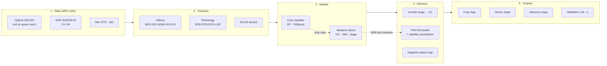

# KrishiMitra-RS 🛰️🌾

**AI-driven crop-type mapping, phenology-aware moisture-stress detection and
FAO-56 irrigation advisory from moderate-resolution optical + microwave (SAR)
satellite data.**

This is the remote-sensing engine of KrishiMitra. It turns a season of
Sentinel-2 (optical) and Sentinel-1 (SAR) observations over a **canal command
area** into three decision-ready map products:

1. a **crop-type map** (Random Forest / XGBoost on multi-temporal signatures),
2. **stage-wise moisture-stress maps** (VCI + SAR soil-moisture, weighted by
   growth stage), and
3. an **8-day irrigation advisory** (FAO-56 crop water deficit → action per pixel).

It runs **end-to-end out of the box** on a physically-grounded synthetic pilot
(no downloads, no GPU) and swaps to **real Sentinel-1/2 via Google Earth Engine**
by changing one config line.

---

## Why two data paths?

| Path | Command | Needs | Use |
|------|---------|-------|-----|
| **Simulated** (default) | `python -m krishimitra_rs.pipeline` | nothing beyond the core deps | demo / hackathon / CI — reproducible, runs anywhere |
| **Real (GEE)** | set `data.source: gee` + AOI, then run | `earthengine-api`, EE account | a real pilot command area |

The simulator is not decorative: it runs a real FAO-56 water balance with
canal-limited irrigation so the crop, stress and advisory layers are internally
consistent and checkable against a known truth — which is how the pipeline
*validates itself* (see below).

---

## Pipeline architecture



Cleanly layered so each stage is independently testable and swappable:
`data → features → models → advisory → validation → viz`.

---

## How it maps to the problem statement

| Brief requirement | Where it lives |
|---|---|
| Multi-temporal crop-type classification (RF / XGBoost) | [`models/crop_classifier.py`](src/krishimitra_rs/models/crop_classifier.py) |
| Optical indices NDVI / EVI / NDWI | [`features/indices.py`](src/krishimitra_rs/features/indices.py) |
| SAR features VV / VH / ratio (RVI, CR) | [`features/indices.py`](src/krishimitra_rs/features/indices.py) |
| GLCM texture | [`features/texture.py`](src/krishimitra_rs/features/texture.py) |
| Phenology metrics (SOS / peak / LGP) | [`features/phenology.py`](src/krishimitra_rs/features/phenology.py) |
| Stage-wise moisture stress (VCI, SMI, VCI-bins) | [`models/stress.py`](src/krishimitra_rs/models/stress.py) |
| Phenology-aware growth stages | [`features/phenology.py`](src/krishimitra_rs/features/phenology.py) · [`advisory/phenology_stage.py`](src/krishimitra_rs/advisory/phenology_stage.py) |
| 8-day crop water deficit (ETc, water balance) | [`advisory/water_balance.py`](src/krishimitra_rs/advisory/water_balance.py) |
| Irrigation advisory maps | [`advisory/irrigation.py`](src/krishimitra_rs/advisory/irrigation.py) |
| Validation: Overall Accuracy, Kappa | [`models/crop_classifier.py`](src/krishimitra_rs/models/crop_classifier.py) · [`validation/metrics.py`](src/krishimitra_rs/validation/metrics.py) |
| LSTM / Temporal-CNN | [`models/temporal_dl.py`](src/krishimitra_rs/models/temporal_dl.py) (optional) |
| Real ingestion (S1/S2/MODIS via GEE) | [`data/gee_ingest.py`](src/krishimitra_rs/data/gee_ingest.py) |
| Dashboard / time-series visualisation | [`dashboard/app.py`](dashboard/app.py) · [`viz/maps.py`](src/krishimitra_rs/viz/maps.py) |

---

## Quickstart

```bash
cd satellite-ml
python3 -m venv .venv && source .venv/bin/activate
pip install -e .                          # installs the package + core deps

python -m krishimitra_rs.pipeline         # ~5 s on a laptop
# equivalent:
#   krishimitra-rs                        # console script (works from any directory)
#   python scripts/run_pipeline.py        # no install needed (adds src/ to sys.path)
```

> **`pip install -e .` is not optional.** `python -m krishimitra_rs.pipeline`
> imports the package, and this repo uses a `src/` layout — without an install
> (editable or not) you get `ModuleNotFoundError: krishimitra_rs`.
> `pip install -r requirements.txt` alone installs the *dependencies*, not the
> package. If you would rather not install anything, use
> `python scripts/run_pipeline.py`, which puts `src/` on `sys.path` for you.

Outputs land under `outputs/`:

```
outputs/
├── maps/       crop_type_map.png · moisture_stress_map.png · irrigation_advisory_map.png (+ .tif with rasterio)
├── figures/    phenology_curves.png · timeseries_panels.png · confusion_matrix.png
├── tables/     run_summary.json · validation_report.json · per_crop_area.csv
└── models/     crop_classifier.joblib
```

Tests:

```bash
pip install pytest
python -m pytest tests/ -v                # 13 tests, ~12 s
```

Interactive dashboard:

```bash
pip install streamlit
streamlit run dashboard/app.py            # http://localhost:8501
```

Batch container (runs on any container host):

```bash
docker build -t krishimitra-satellite satellite-ml/
docker run --rm -v "$PWD/outputs:/app/outputs" krishimitra-satellite
```

See [`Dockerfile`](Dockerfile) for the Earth Engine service-account variables
(`EE_SERVICE_ACCOUNT_JSON`, `EE_PROJECT`) used by the `--source gee` run.

---

## Measured results

Every number below is read straight out of `outputs/tables/validation_report.json`
for the **default simulated pilot** — seed `20250426`, 140 × 140 grid, 21 × 8-day
composites over Rabi 2024-11-01 → 2025-04-10. Reproduce with
`python -m krishimitra_rs.pipeline`.

### Crop-type classification (field-disjoint validation, n = 438 pixels)

| Metric | Value |
|---|---|
| **Overall Accuracy** (Random Forest, deployed) | **92.92 %** (target > 85 % ✓) |
| **Cohen's κ** | **0.9151** |
| XGBoost (runner-up) | OA 91.78 %, κ 0.9014 |
| Train / validation pixels | 1320 / 438, **field-disjoint** (no field spans both sets) |

Per-class F1 on the held-out fields:

| Crop | Producer's acc. | User's acc. | F1 |
|---|---|---|---|
| Fallow | 1.000 | 1.000 | 1.000 |
| Wheat | 0.918 | 0.944 | 0.931 |
| Mustard | 0.740 | 0.931 | 0.824 |
| Sugarcane | 0.945 | 0.986 | 0.965 |
| Potato | 0.973 | 0.986 | 0.979 |
| Gram | 1.000 | 0.777 | 0.874 |

The confusion that remains is agronomically sensible: 18 of the 73 Mustard
validation pixels are predicted as Gram — two low-biomass Rabi crops with
similar canopy structure. That is what a *credible* (not suspiciously perfect)
result looks like.

> **Why not 100 %?** Because every field of a crop is given realistic per-field
> variation in sowing date, vigour and canopy structure. Identical signatures
> would inflate accuracy to a meaningless 100 %.

### Moisture stress vs. the simulator's latent truth (Ks)

| Metric | Value |
|---|---|
| Fused condition vs. latent Ks (corr) | **+0.400** (positive = healthier canopy where the crop really is wetter) |
| Stress class, exact agreement | 0.547 |
| Stress class, within-1-class agreement | 0.825 |

### Advisory credibility

| Metric | Value |
|---|---|
| Recommended gross depth vs. latent Ks (corr) | **−0.371** (negative = more water advised where the crop is genuinely drier) |
| Recommended gross depth vs. observed condition (corr) | −0.276 |

Headline (peak-demand) composite **2025-01-28**: 329.2 ha need irrigation now or
soon, 261.0 ML gross demand, 20.7 % of the command area "Irrigate now" and
21.3 % "Schedule".

Runtime: **4-5 s** end-to-end including figure rendering, of which ~3.4 s is
fitting RF + XGBoost and 0.8 s is rendering (`timings_sec` in
`outputs/tables/run_summary.json`).

> Measured on Python 3.13.7 / numpy 2.2.6 / scipy 1.17.1 / scikit-learn 1.7.0 /
> xgboost 3.2.0. The correlations above are stable across library versions;
> the classification OA moves by a few tenths of a point (93.4 % on
> scikit-learn 1.9 / numpy 2.5) because the tree ensembles differ slightly.

---

## Methodology notes (defensible choices)

- **Field-disjoint validation.** Ground-truth pixels are split so whole *fields*
  go to train or validation, never both — the honest way to avoid
  spatial-autocorrelation leakage that otherwise inflates accuracy.
- **VCI (single-season surrogate).** Classic VCI needs a multi-year NDVI archive;
  with one season we compare each pixel to its **crop-and-date cohort** (healthy
  peers of the same crop on the same date). The multi-year formula is a drop-in
  once an archive exists.
- **SAR for soil moisture (all-weather).** VV backscatter drives the Soil-Moisture
  Index and anchors the water balance — the layer that survives monsoon cloud
  when optical fails. It is multi-looked with a 5 × 5 boxcar before calibration,
  because raw C-band speckle (~1.7 dB) is comparable to the soil-moisture signal
  itself.
- **Prognostic FAO-56 water balance.** Kc is rebuilt from the *satellite-detected*
  growth stage (not a fixed calendar), and root-zone depletion is **integrated
  over time** — `Dr[t] = clip(Dr[t-1] + ETc[t] − Peff[t] − Irr[t], 0, TAW)` —
  exactly as FAO-56 Ch. 8 prescribes. Canal deliveries are not observed, so the
  irrigation term is *inferred*: whenever the satellite reads wetter than the
  bucket predicts, water must have been applied, and half that discrepancy
  (`advisory.irrigation_inference_gain`) enters the balance as a one-sided
  source. The satellite wetness itself is only a **weak nudge**
  (`Dr = 0.75·model + 0.25·observation`), never the primary estimate. The deficit
  is reported as a stock against the Readily-Available-Water threshold — the
  standard irrigation-scheduling view.
- **Canopy-weighted canopy-water term.** The optical NDWI contribution to the
  wetness proxy is scaled by fractional canopy cover, so bare or barely-emerged
  ground — optically "dry" simply because there is no canopy — falls back on SAR
  alone. Without this, *low vegetation* is indistinguishable from *dry soil* and
  the advisory waters unstressed early-season fields.
- **Ripening cut-off from the crop calendar, not the observed peak.** Advice is
  capped at "Monitor" only inside the final
  `advisory.stop_irrigation_days_before_harvest` (default 15) days before the
  crop's agronomic harvest date. Anchoring that rule on each pixel's own NDVI
  peak is wrong: a water-stressed crop senesces *early*, so a peak-anchored rule
  declares the driest fields "mature" and switches the advisory off precisely
  where irrigation is most needed. Post-peak grain filling stays irrigable.
- **Phenology-aware everywhere.** The same soil dryness is scored more severely at
  flowering than at maturity (stage-sensitivity weights), and advice is muted on
  fallow ground.

---

## Running on real satellite data (Google Earth Engine)

```bash
pip install -e ".[gee]"           # earthengine-api + geemap + geopandas
earthengine authenticate          # one-time, laptop only
```

Then in `config/pilot_area.yaml`:

```yaml
data:
  source: gee
pilot:
  aoi_bbox: [<min_lon>, <min_lat>, <max_lon>, <max_lat>]   # your command area
```

```bash
python -m krishimitra_rs.pipeline --source gee
```

`data/gee_ingest.py` builds the *same* `DataCube` from Sentinel-2 L2A
(cloud-masked, 8-day medians) + Sentinel-1 GRD (VV/VH, speckle-reduced) +
ERA5-Land met — so the rest of the pipeline is unchanged.

**Headless / container authentication.** `earthengine authenticate` needs a
browser, which a batch job does not have. Set instead:

| Variable | Meaning |
|---|---|
| `EE_SERVICE_ACCOUNT_JSON` | the service-account key — raw JSON, or a path to a mounted key file |
| `EE_PROJECT` | Earth Engine / GCP project to bill (falls back to `GOOGLE_CLOUD_PROJECT`, then the key's `project_id`) |

With neither set, ingestion falls back to Application Default Credentials or
your local `earthengine authenticate` token, so laptop runs are unchanged.

**Ground truth (labels).** The GEE cube has no crop labels, so supervised crop
typing is **skipped with an explicit log message** and the pipeline continues on
an unsupervised cropland mask (NDVI-amplitude threshold, FAO-56 parameters taken
from the pilot's reference crop). Indices, phenology, moisture stress and the
whole FAO-56 advisory still run; only OA/κ are unavailable, and
`validation_report.json` says so rather than reporting a fabricated accuracy.

To get real crop typing on GEE data, supply labels:

```yaml
data:
  labels_path: data/raw/ground_truth_labels.npy   # (H, W) int crop codes, 0 = fallow
```

`.npy` or comma-separated `.csv` on the config grid. Alternatively wire an Earth
Engine ground-truth `FeatureCollection` into `sample_ground_truth`.

See [`DATASETS.md`](DATASETS.md) for every data source (Bhoonidhi, Copernicus,
NISAR, ground-truth options) and how to obtain them.

---

## Configuration

Everything is driven by [`config/pilot_area.yaml`](config/pilot_area.yaml):
season dates, grid, the crop library (phenology + FAO-56 Kc + SAR signatures),
meteorology, ground-truth sampling, stress thresholds, advisory bins and the
water-balance assimilation gains. Change the crops, the season or the AOI there
— no code edits needed. Override the file entirely with `--config <path>`.

A byte-identical copy ships **inside the package** at
`src/krishimitra_rs/config/pilot_area.yaml`, so the `krishimitra-rs` console
script resolves a default config after a plain (non-editable) `pip install .`
from any working directory. Resolution order: `--config` → the repo's
`config/pilot_area.yaml` (source checkout) → the packaged copy.
`tests/test_pipeline.py::test_packaged_config_matches_repo_config` fails if the
two drift, so **edit both** (or copy one over the other).

For an installed (non-editable) package, `outputs/` and `data/` are written
relative to the **current working directory** — site-packages is never polluted.

---

## Scaling from pilot to region

- The grid, crop list and AOI are config, not code — point it at a larger
  command area or a new season and re-run.
- Feature extraction and the water balance are fully vectorised (NumPy); a
  moderate command area runs in seconds.
- For province-scale runs, tile the AOI, run per tile (embarrassingly parallel),
  and mosaic the GeoTIFF outputs.
- Swap RF/XGBoost for the LSTM/Temporal-CNN (`models/temporal_dl.py`, needs
  `torch`) when training data volume warrants it.
- The [`Dockerfile`](Dockerfile) packages the pipeline as a **host-agnostic batch container**
  (batch, no HTTP listener); artifacts land in `/app/outputs`.

---

## Project layout

```
satellite-ml/
├── config/pilot_area.yaml           # the single source of agronomic truth (editable)
├── src/krishimitra_rs/
│   ├── config/__init__.py           # typed config + season/time helpers
│   ├── config/pilot_area.yaml       # packaged default (kept identical to the above)
│   ├── data/                        # simulate.py · gee_ingest.py · ard.py
│   ├── features/                    # indices · texture · phenology · build
│   ├── models/                      # crop_classifier · stress · temporal_dl
│   ├── advisory/                    # phenology_stage · water_balance · irrigation
│   ├── validation/metrics.py        # OA · kappa · credibility checks
│   ├── viz/maps.py                  # colour-coded maps + time-series
│   └── pipeline.py                  # end-to-end orchestration + CLI
├── scripts/                         # run_pipeline.py · make_pilot_dataset.py
├── dashboard/app.py                 # Streamlit dashboard
├── notebooks/                       # end-to-end walkthrough
├── Dockerfile                       # batch container image (any host)
└── tests/                           # pytest suite (13 tests, ~12 s)
```

---

## Limitations & honesty

- The **default run is simulated**. Numbers demonstrate that the *methodology*
  works and is self-consistent; real-world accuracy depends on ground-truth
  quality, sensor cadence and cloud cover, and must be re-measured on real data.
- The VCI surrogate and the SAR→soil-moisture calibration (`_VV_DRY_DB`,
  `_VV_WET_DB` in `advisory/water_balance.py`) are simplified for a
  moderate-resolution, single-season prototype and should be re-fitted per
  sensor and AOI; both have documented upgrade paths (multi-year VCI,
  sensor-specific SAR retrieval).
- The inferred-irrigation term is a stand-in for canal-roster data. Where actual
  delivery records exist, feed them in directly instead — the bucket takes an
  irrigation depth either way.
- GLCM texture uses a fast difference-based approximation by default (a full
  windowed GLCM is available with `scikit-image`).

Built for the KrishiMitra platform. See the repository root README for the
farmer-facing application this engine feeds.
